# TranslationZed-Py — Code Architecture
_Last updated: 2026-03-05_

This document is the concrete code-level architecture reference.
It complements:
- `docs/spec/technical.md` (normative contracts)
- `docs/reference/module_map.md` (ownership map)

## 1) Architecture Paradigm (As Implemented)

TranslationZed-Py uses a pragmatic layered architecture:
1. **Qt adapter shell** in `translationzed_py/gui/*` (`MainWindow` and helpers).
2. **Qt-free workflow services** in `translationzed_py/core/*`.
3. **Deterministic persistence and algorithms** (parser/saver/cache/TM/search).

Operational pattern in code:
- GUI translates user actions into service calls.
- Core services return explicit plan/result DTOs.
- GUI applies plans and owns dialogs/widgets.
- Core never imports Qt types.

## 2) Core Data Model And Types

### 2.1 Core entities and value objects

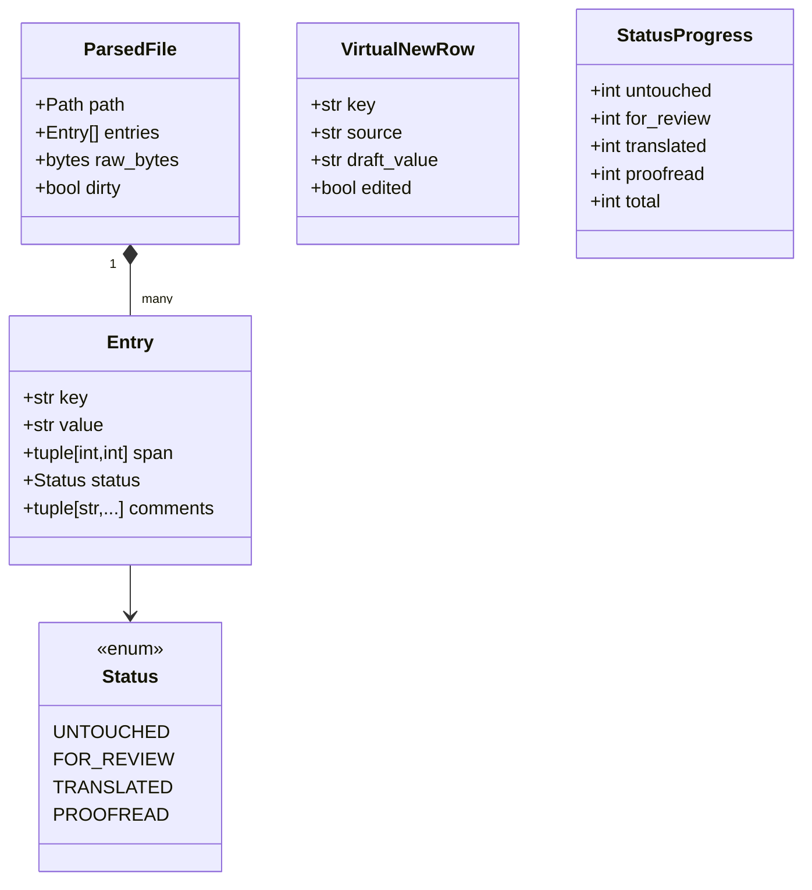

### 2.2 EN diff model set

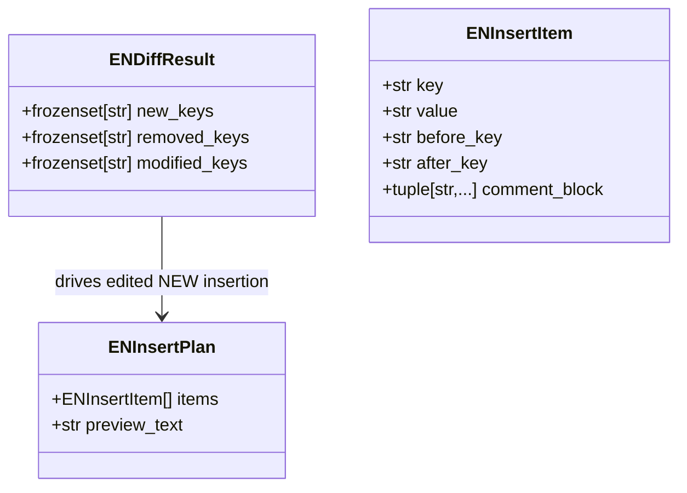

## 3) Core Services, DTOs, And Callback Boundaries

### 3.1 Workflow services and plan DTO contracts

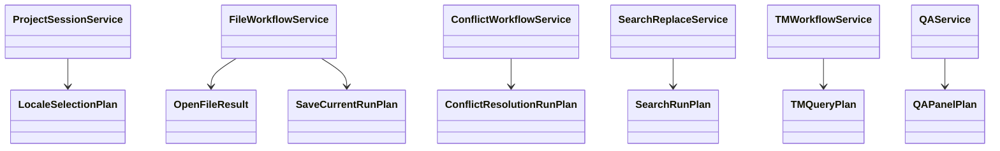

### 3.2 Adapter-facing callback/protocol points

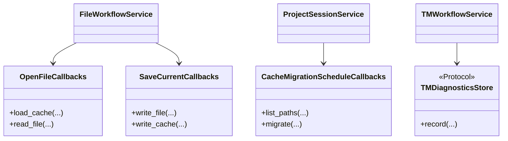

Dense source reference:
- `docs/diagrams/src/core_service_contracts_dense.puml`

### 3.3 Workflow Internals (Code-Level UML)

#### 3.3.1 `project_session` internals

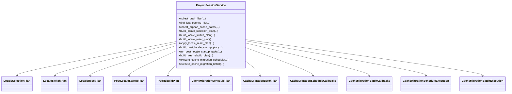

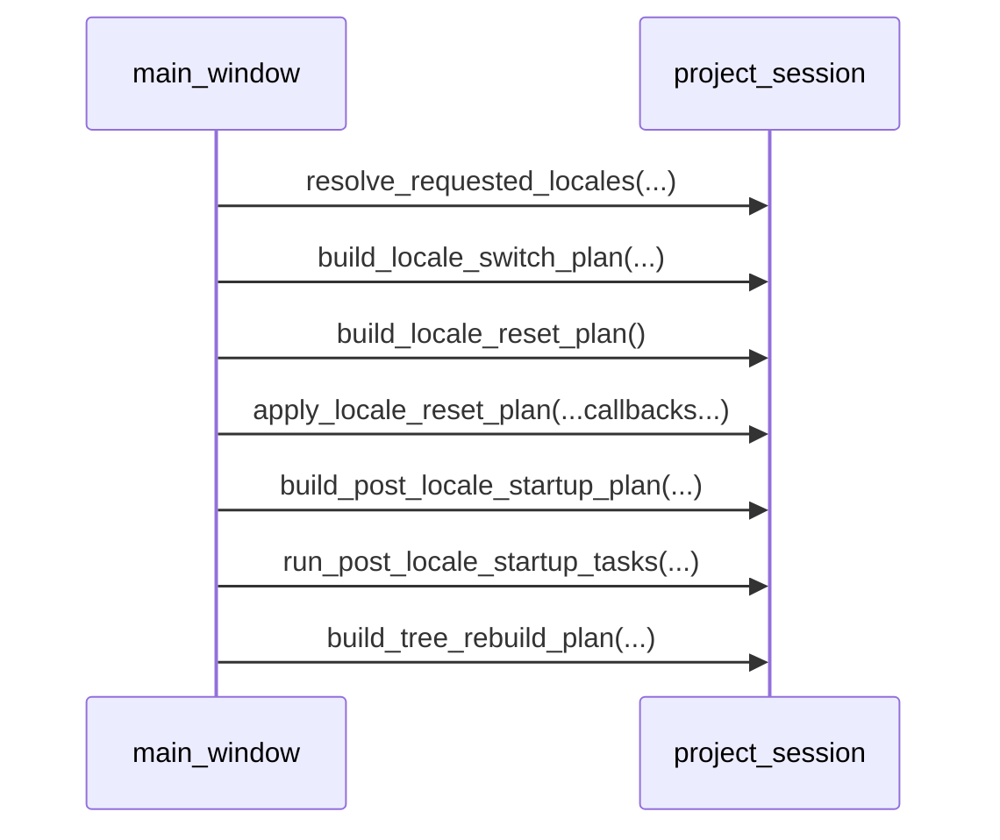

#### 3.3.2 `file_workflow` internals

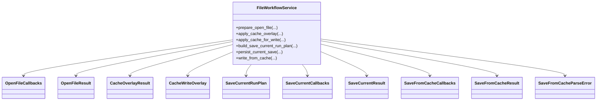

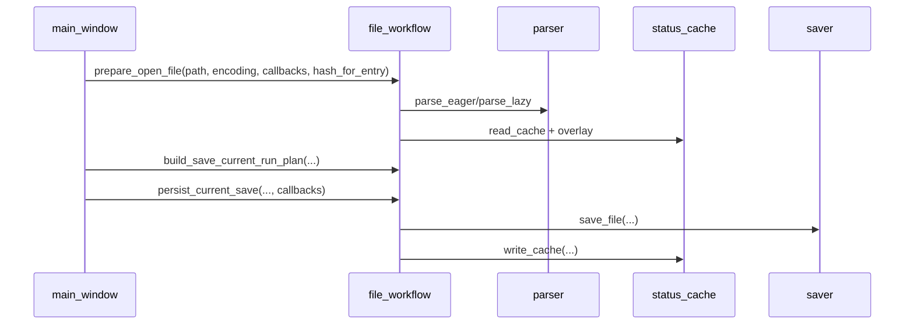

#### 3.3.3 `search_replace_service` internals

```mermaid
classDiagram
  class SearchReplaceService {
    +scope_files(...)
    +build_search_run_plan(...)
    +find_match_in_rows(...)
    +search_across_files(...)
    +build_replace_request(...)
    +build_replace_all_run_plan(...)
    +apply_replace_all(...)
  }

  class SearchRunPlan
  class SearchPanelPlan
  class SearchPanelItem
  class SearchRowsCacheKey
  class SearchRowsCacheStamp
  class SearchRowsCacheLookupPlan
  class SearchRowsCacheStorePlan
  class SearchRowsSourcePlan
  class SearchRowsBuildResult
  class SearchMatchOpenPlan
  class SearchMatchApplyPlan
  class ReplaceRequest
  class ReplaceAllPlan
  class ReplaceAllRunPlan
  class ReplaceAllFileCountCallbacks
  class ReplaceAllFileApplyCallbacks
  class ReplaceAllRowsCallbacks
  class ReplaceCurrentRowCallbacks
  class ReplaceAllFileApplyResult
  class ReplaceAllRowsApplyResult
  class ReplaceRequestError
  class ReplaceAllFileParseError

  SearchReplaceService --> SearchRunPlan
  SearchReplaceService --> SearchPanelPlan
  SearchReplaceService --> SearchPanelItem
  SearchReplaceService --> SearchRowsCacheKey
  SearchReplaceService --> SearchRowsCacheStamp
  SearchReplaceService --> SearchRowsCacheLookupPlan
  SearchReplaceService --> SearchRowsCacheStorePlan
  SearchReplaceService --> SearchRowsSourcePlan
  SearchReplaceService --> SearchRowsBuildResult
  SearchReplaceService --> SearchMatchOpenPlan
  SearchReplaceService --> SearchMatchApplyPlan
  SearchReplaceService --> ReplaceRequest
  SearchReplaceService --> ReplaceAllPlan
  SearchReplaceService --> ReplaceAllRunPlan
  SearchReplaceService --> ReplaceAllFileCountCallbacks
  SearchReplaceService --> ReplaceAllFileApplyCallbacks
  SearchReplaceService --> ReplaceAllRowsCallbacks
  SearchReplaceService --> ReplaceCurrentRowCallbacks
  SearchReplaceService --> ReplaceAllFileApplyResult
  SearchReplaceService --> ReplaceAllRowsApplyResult
  SearchReplaceService --> ReplaceRequestError
  SearchReplaceService --> ReplaceAllFileParseError
```

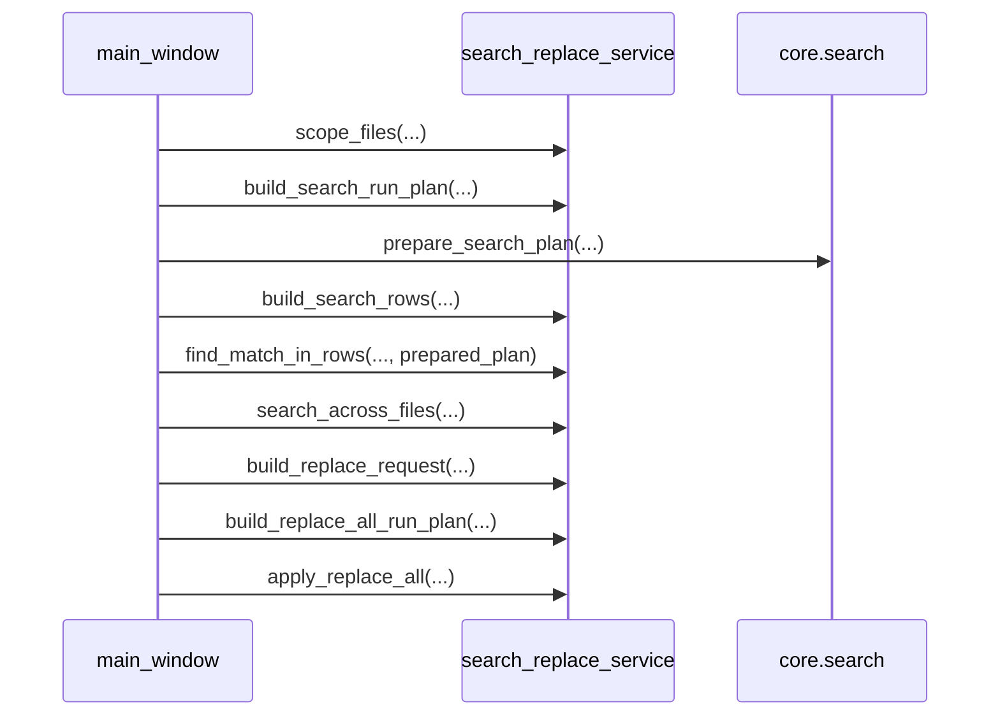

## 4) GUI Controllers And Adapters

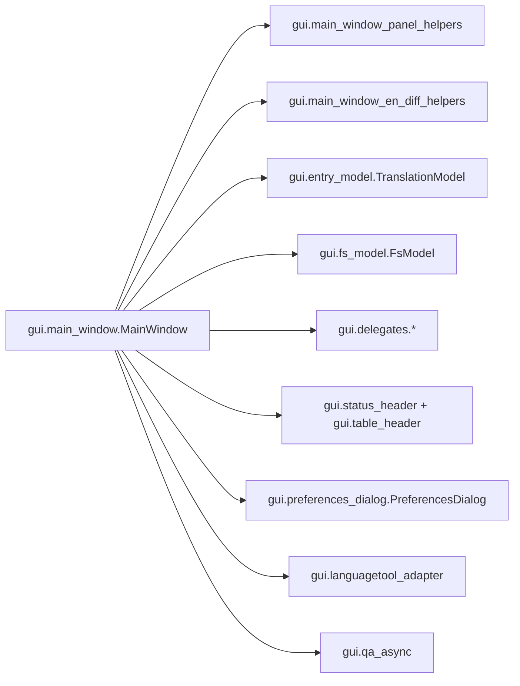

Dense source reference:
- `docs/diagrams/src/gui_controller_adapters_dense.puml`

## 5) Data Lifecycle (Parse -> Edit -> Cache -> Save)

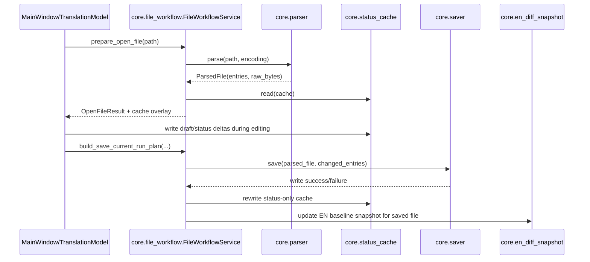

## 6) EN Diff + NEW Insertion Orchestration

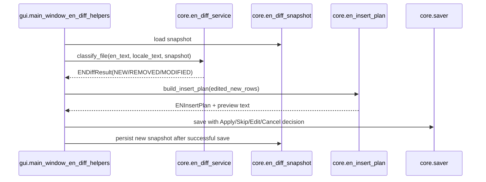

## 7) QA + LanguageTool Integration Sequence (Current v0.8.0)

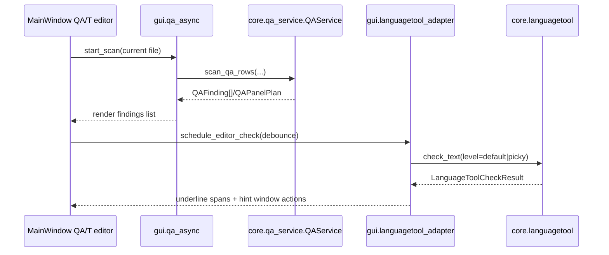

### 7.1 v0.9 target: QA live checklist call chain

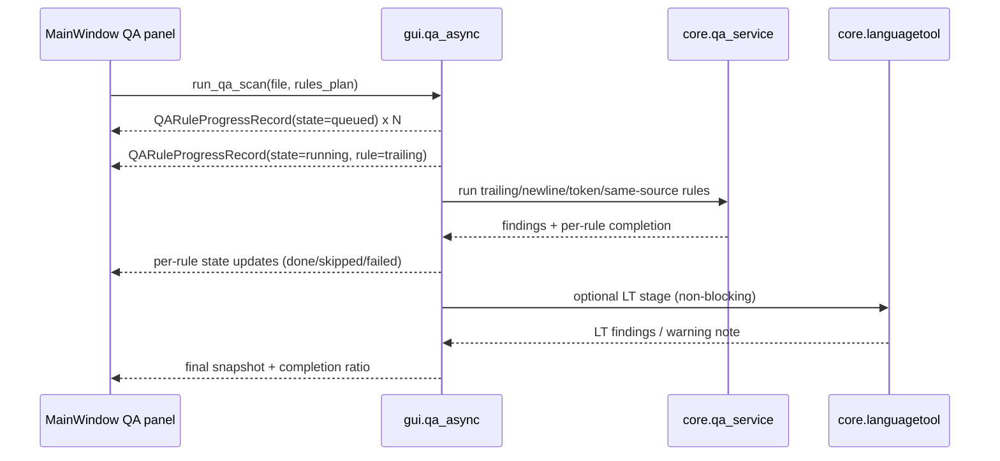

## 8) TM Orchestration + Ranking Pipeline

- Module review status: `translationzed_py/core/tm_store.py` closed in A15-TM-RF1
  (`docs/reference/review_queue.json`, `status=CLOSED`, `closed_at=2026-03-01`).

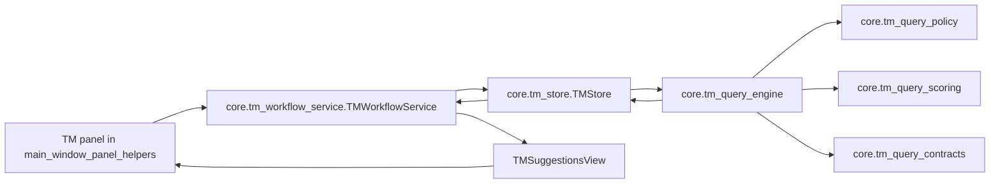

### 8.1 TM Long-Variant Detection Pipeline

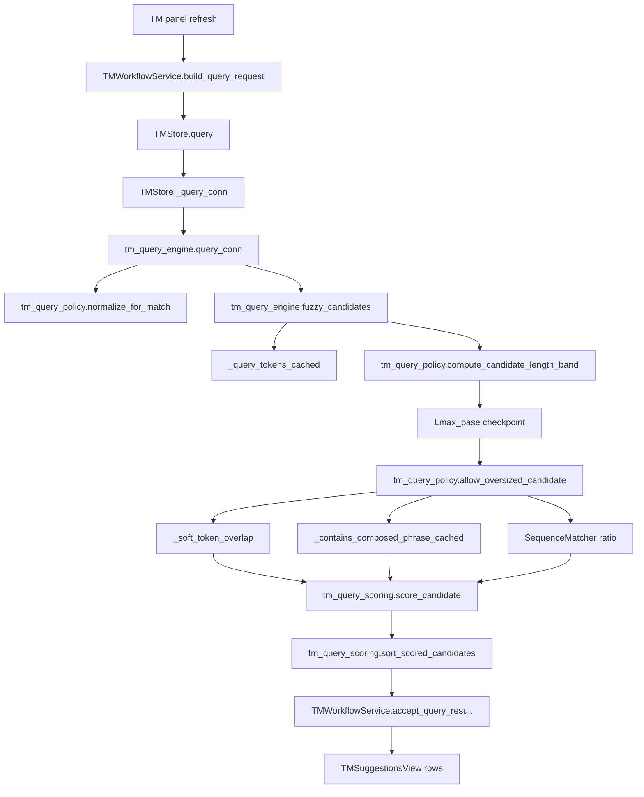

### 8.2 v0.9 target: TM explainability call chain

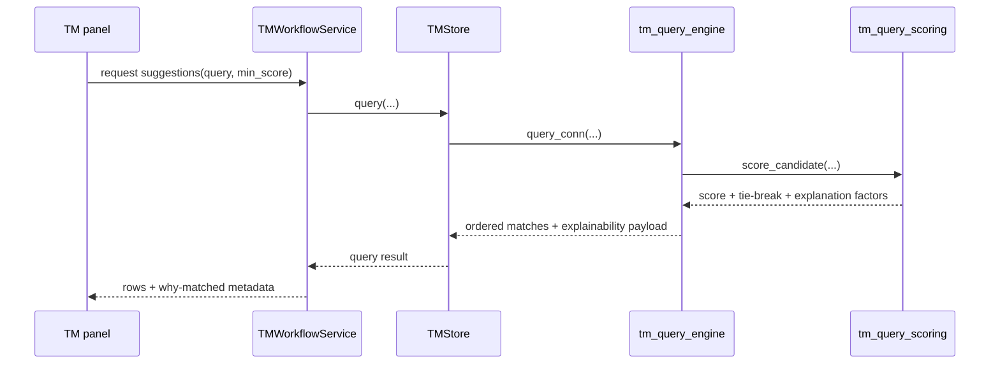

## 9) v0.9 target: Startup crash recovery call chain

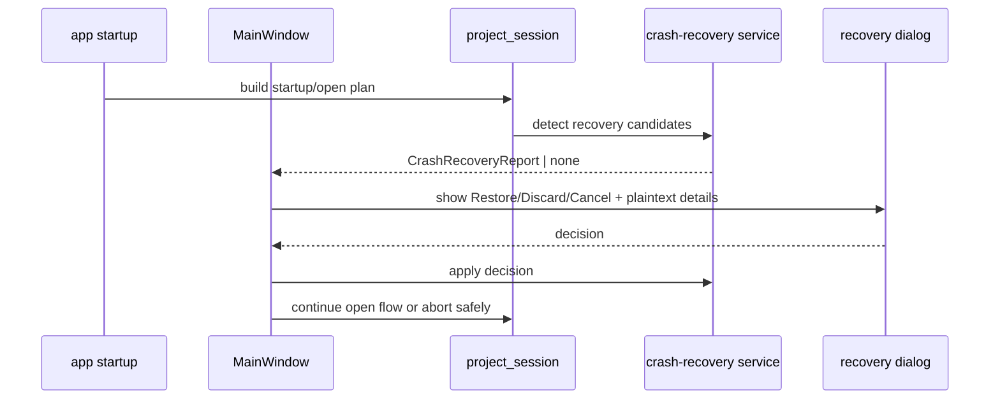
## 10) Dependency Direction Contract

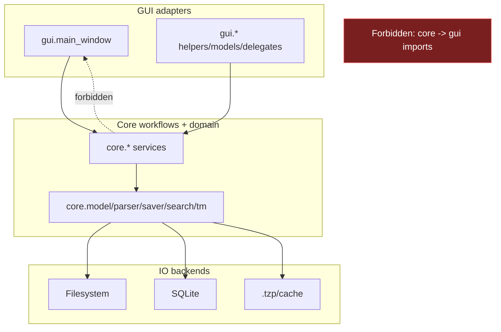

## 11) Programming Model Notes For Contributors

1. Keep business decisions in core service modules, not Qt slots/widgets.
2. Add DTO-first APIs (dataclasses/protocols) for cross-layer boundaries.
3. Keep parser/saver/search/TM changes deterministic and benchmarked.
4. If adding GUI behavior, wire through helper adapters before growing `main_window.py`.
5. Update this document and `docs/reference/module_map.md` when adding or moving ownership.

## 12) Document-or-Flag Status

Current queue state:
1. Active queue entries:
   - `FLAGGED_MODULE: translationzed_py/core/project_session.py`
   - status: `IN_REFACTOR` (`A26`, crash-recovery decision application + safety guards)
   - `FLAGGED_MODULE: translationzed_py/core/tm_query_engine.py`
   - status: `IN_REFACTOR` (`A21`, TM explainability determinism guards)
   - `FLAGGED_MODULE: translationzed_py/core/saver.py`
   - status: `IN_REFACTOR` (`A30-TZP-2`, optional `TZP:` write-back integration in save path)
2. Previous P1 entries (`preferences.py`, `search_replace_service.py`,
   `tm_store.py`) are closed and retained as historical evidence.

Rule when new risk is detected:
1. Add `FLAGGED_MODULE: translationzed_py/<path>.py` in this document.
2. Add queue entry in `docs/reference/review_queue.json` with closure criteria.
3. Keep only factual internals for flagged modules until closure.
