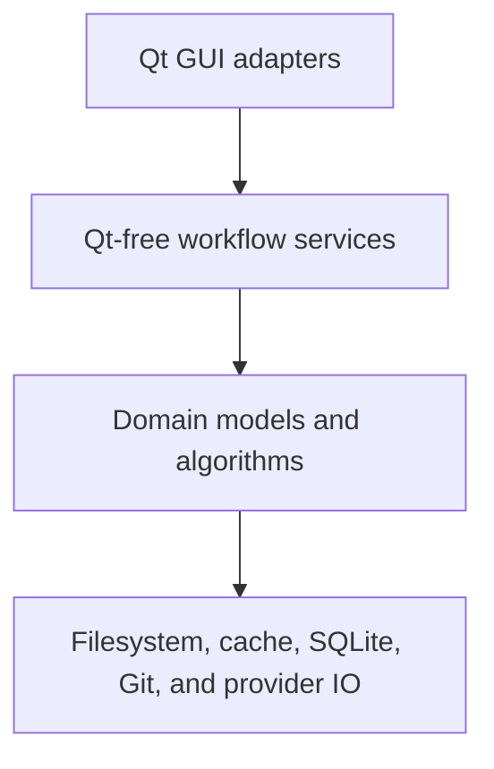

# TranslationZed-Py — Code Architecture
_Last updated: 2026-07-15_

This document owns code-level dependency, packaging, extension, and source-documentation rules.
Use `docs/reference/module_map.md` for exact module ownership, `docs/spec/technical.md` for current
behavior, and generated API pages for signatures. Private method inventories do not belong here.

## 1) Dependency Model

These are logical layers within two application packages, not a requirement to create one package
per box.

1. `translationzed_py.gui` may import `translationzed_py.core`; core never imports Qt or GUI code.
2. Widgets own rendering, signals, focus, dialogs, and GUI-thread scheduling. User-independent
   decisions belong in core.
3. Core algorithms remain deterministic. Filesystem, process, database, and network effects enter
   through narrow functions, callbacks, or protocols that can be replaced in tests.
4. Dependencies point toward the decision owner. Do not add circular imports, service locators, or
   a global application container to avoid choosing an owner.
5. A conceptual layer does not justify an abstraction by itself. Introduce a boundary when it
   isolates a real effect, removes repeated policy, or supports multiple implementations.

## 2) Physical Package Layout

| Location | Owns |
|---|---|
| `translationzed_py/__main__.py` | CLI parsing, frozen-runtime setup, and lazy GUI launch. |
| `translationzed_py/core/` | Models, parsing/saving, persistence, deterministic algorithms, workflow policy, and effect adapters that do not depend on Qt. |
| `translationzed_py/gui/` | Qt widgets, models, dialogs, commands, asynchronous scheduling, and translation between UI state and core DTOs. |
| `tests/` | Behavior and boundary evidence; its layout follows owned behavior, not necessarily one test file per source file. |
| `scripts/` | Stable automation internals behind the small Make facade. |
| `docs/` | Canonical contracts and focused handoffs according to `docs/meta/docs_structure.md`. |

Keep packages flat by default. Create a subpackage only when several cohesive modules already need
one stable namespace and the move removes recurring ownership ambiguity. Line count, a single new
class, or a desire for symmetry is not sufficient.

- Keep `__init__.py` files inert unless a small intentional public surface is required.
- Do not create generic `utils`, `helpers`, `common`, or `manager` modules. Keep a helper beside its
  owner; name a shared module after the concept it owns.
- Do not preserve old import paths with forwarding modules unless an actual external interface is
  supported. Internal imports may change in one tested refactor.
- Split a module along decisions or effects, not arbitrary line ranges. The original module should
  become a smaller coordinator, not a second copy of the moved policy.

## 3) Cross-Layer Contracts

Use the smallest representation that makes a boundary explicit:

- an immutable dataclass for a value or plan that crosses layers, supports preview/cancel/apply, or
  carries several related results;
- a callback bundle when a workflow sequences caller-owned effects;
- a `Protocol` when two implementations exist or tests must replace an external effect;
- a direct function call for local, single-purpose behavior.

Do not create DTOs that merely rename arguments, one-implementation interfaces, or inheritance
trees for hypothetical providers. Plans describe decisions; GUI adapters render them and perform
only the effects the plan authorizes.

Long-running GUI work follows one pattern:

1. capture an immutable request and identity on the GUI thread;
2. execute bounded Qt-free work off the GUI thread;
3. return a result DTO;
4. apply it only if project, file, row, and request identity are still current;
5. cancel or ignore stale work on switches and shutdown.

## 4) Persistence And Compatibility

The durable compatibility surface is intentionally small:

- locale bytes, structure, line endings, and declared encoding outside intentional edits;
- versioned `.tzp` cache, session, snapshot, and configuration data;
- TM database/import formats;
- the `tz` command and documented Make targets;
- documented user preferences and project-local settings.

Internal classes, private functions, and module paths are not a public library API. Refactor them
atomically with their consumers and tests.

Persistent schema changes require explicit version handling, migration tests, corrupt-input
fallback, and atomic writes. A legacy reader or path must have a concrete migration purpose; do not
add permanent dual paths. Remove it only in a planned compatibility slice after the supported data
has a tested migration or an explicit reset policy.

Opening a project, detecting changes, diagnostics, and synchronization previews are read-only.
Draft cache writes and original-file writes remain distinct; only an explicit Save path changes
locale originals.

## 5) Resource And Performance Policy

- Keep work proportional to the selected file or an explicitly bounded project scope.
- Stream or page large input where practical; cap provider context, result lists, caches, and
  diagnostics.
- Never perform Git, network, model, full-project QA, or large TM work on the GUI thread.
- Cache only when invalidation has a deterministic key. Avoid hidden process-global mutable caches.
- Optimize measured hot paths with equivalence tests and representative benchmarks. Do not trade
  correctness or clarity for unmeasured micro-optimizations.
- External service and model latency is not a stable benchmark target; benchmark local request
  construction, caching, parsing, and result normalization.

## 6) Source Construction Policy

- Prefer direct functions and composition. Add a class when it owns state, lifecycle, or a coherent
  protocol implementation.
- Prefer immutable values at boundaries and explicit mutation inside the narrow owner.
- Validate untrusted filesystem, Git, TOML, database, and provider data at entry points. Preserve
  causal exceptions and return actionable user-facing failures.
- Avoid boolean flag clusters and catch-all methods. Use named operations or small enums when modes
  have different invariants.
- Keep optional provider imports and runtime availability isolated so the application works without
  optional services.
- A refactor must preserve user-visible features and persistent compatibility unless its slice
  explicitly changes them.

## 7) Docstrings And Comments

Documentation should reduce uncertainty, not repeat syntax.

- Give a module a short docstring when its owner or safety boundary is not obvious from its name.
- Document public classes, functions, protocols, and DTOs when callers need an invariant, unit,
  failure mode, side effect, or lifecycle rule that the signature cannot express.
- Private obvious helpers and straightforward tests do not need docstrings merely for coverage.
- Write comments for why a constraint exists, why an apparently simpler operation is unsafe, or
  why a compatibility/performance workaround remains. Do not narrate the next line.
- Do not keep change logs, ticket histories, implementation plans, or copied specifications in
  source comments. Git and the canonical docs own that context.
- Prefer precise names and types over explanatory prose. Remove a stale comment in the same change
  that invalidates it.

## 8) Verification Shape

- Test policy in core without Qt. Use real temporary files, repositories, and SQLite databases when
  their semantics are the contract; fake only the external transport or expensive runtime.
- Test GUI adapters for signal wiring, presentation, stale-result suppression, and user decisions,
  not a second copy of core policy.
- Protect byte/encoding invariants with round-trip and failure-path tests.
- Add performance tests only for a stable workload and explicit budget.
- Run focused tests first, then the gates required by the changed risk surface. The active risk
  register owns extra checks for high-risk modules.

## 9) Change Checklist

Before adding or moving code, answer:

1. Which module owns the decision according to the module map?
2. Is the code Qt-free policy, GUI adaptation, or an external effect?
3. Does a new abstraction remove proven duplication or isolate a tested boundary?
4. Which persistent or user-visible contracts must remain compatible?
5. What bounds the work and invalidates any cache or asynchronous result?
6. Which canonical document and focused tests become inaccurate?

If those answers do not justify a new module or subpackage, keep the implementation local and
direct. Active module-specific risks remain in `docs/reference/risk_register.md`.
