# TranslationZed-Py — Code Architecture
_Last updated: 2026-03-01_

This document is the concrete code-level architecture reference.
It complements:
- `docs/spec/technical.md` (normative contracts)
- `docs/reference/module_map.md` (ownership map)

## 1) Architecture Paradigm (As Implemented)

TranslationZed-Py uses a pragmatic layered architecture:
1. **Qt adapter shell** in `translationzed_py/gui/*` (`MainWindow` and helpers).
2. **Qt-free workflow services** in `translationzed_py/core/*`.
3. **Deterministic persistence and algorithms** (parser/saver/cache/TM/search).

Operational pattern in code:
- GUI translates user actions into service calls.
- Core services return explicit plan/result DTOs.
- GUI applies plans and owns dialogs/widgets.
- Core never imports Qt types.

## 2) Core Data Model And Types

### 2.1 Core entities and value objects

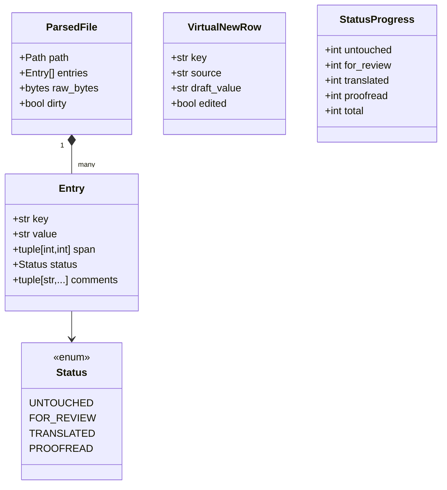

### 2.2 EN diff model set

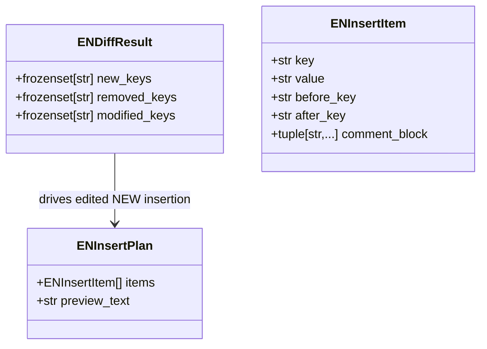

## 3) Core Services, DTOs, And Callback Boundaries

### 3.1 Workflow services and plan DTO contracts

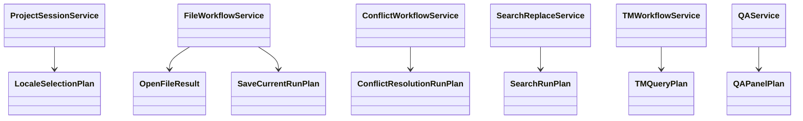

### 3.2 Adapter-facing callback/protocol points

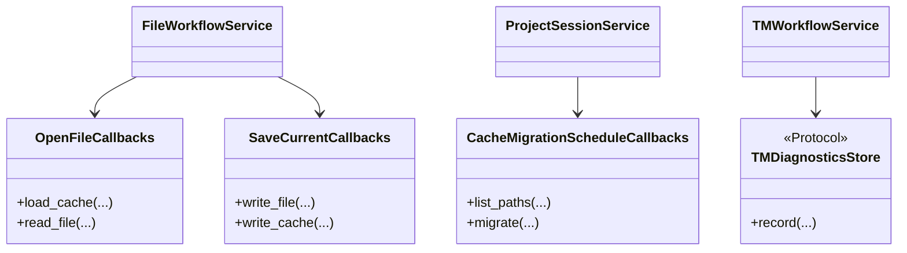

Dense source reference:
- `docs/diagrams/src/core_service_contracts_dense.puml`

## 4) GUI Controllers And Adapters

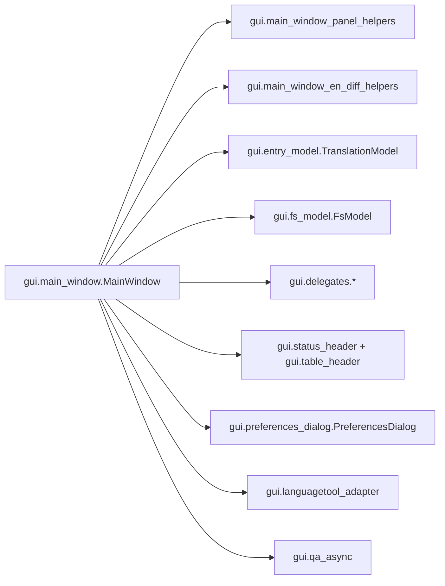

Dense source reference:
- `docs/diagrams/src/gui_controller_adapters_dense.puml`

## 5) Data Lifecycle (Parse -> Edit -> Cache -> Save)

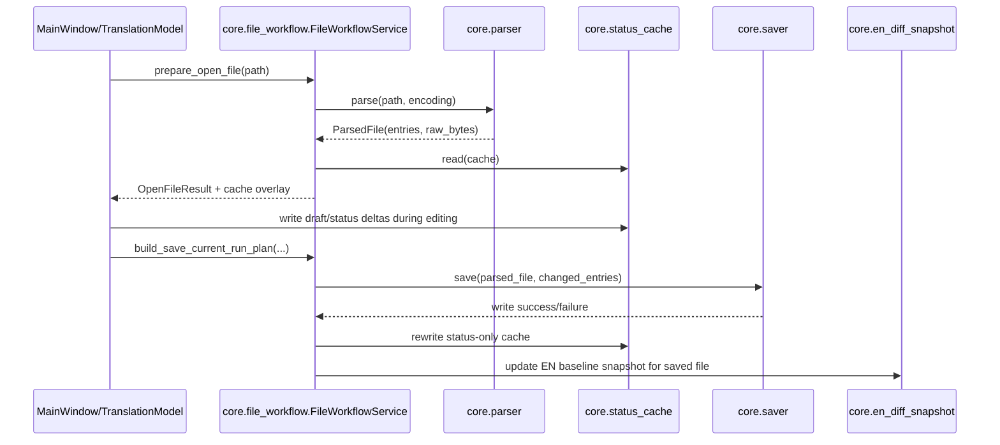

## 6) EN Diff + NEW Insertion Orchestration

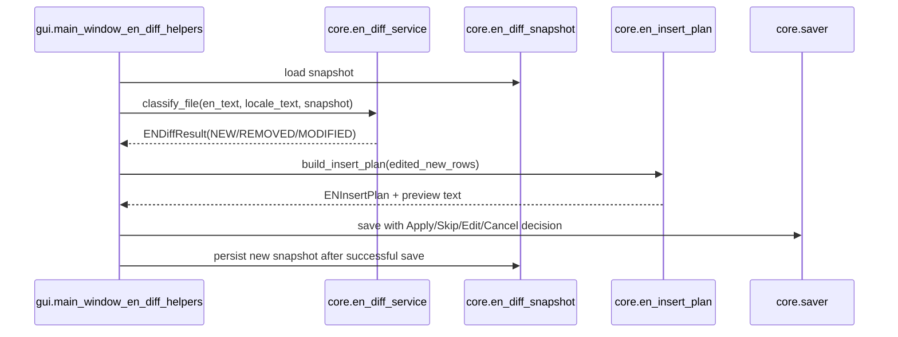

## 7) QA + LanguageTool Integration Sequence

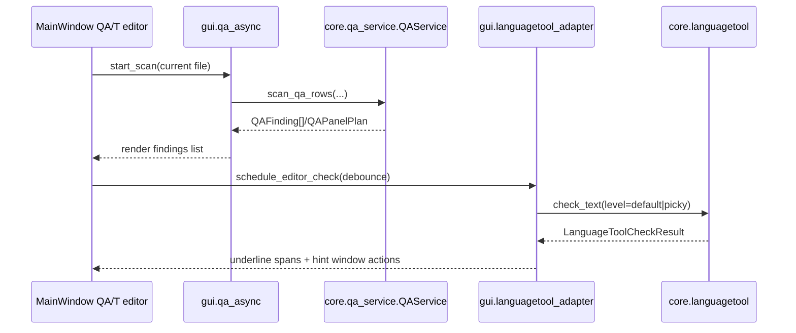

## 8) TM Orchestration + Ranking Pipeline

- Module review status: `translationzed_py/core/tm_store.py` closed in A15-TM-RF1
  (`docs/reference/review_queue.json`, `status=CLOSED`, `closed_at=2026-03-01`).

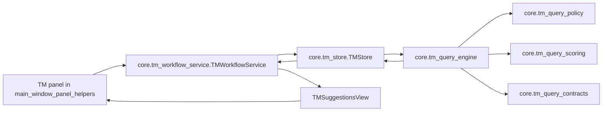

### 8.1 TM Long-Variant Detection Pipeline

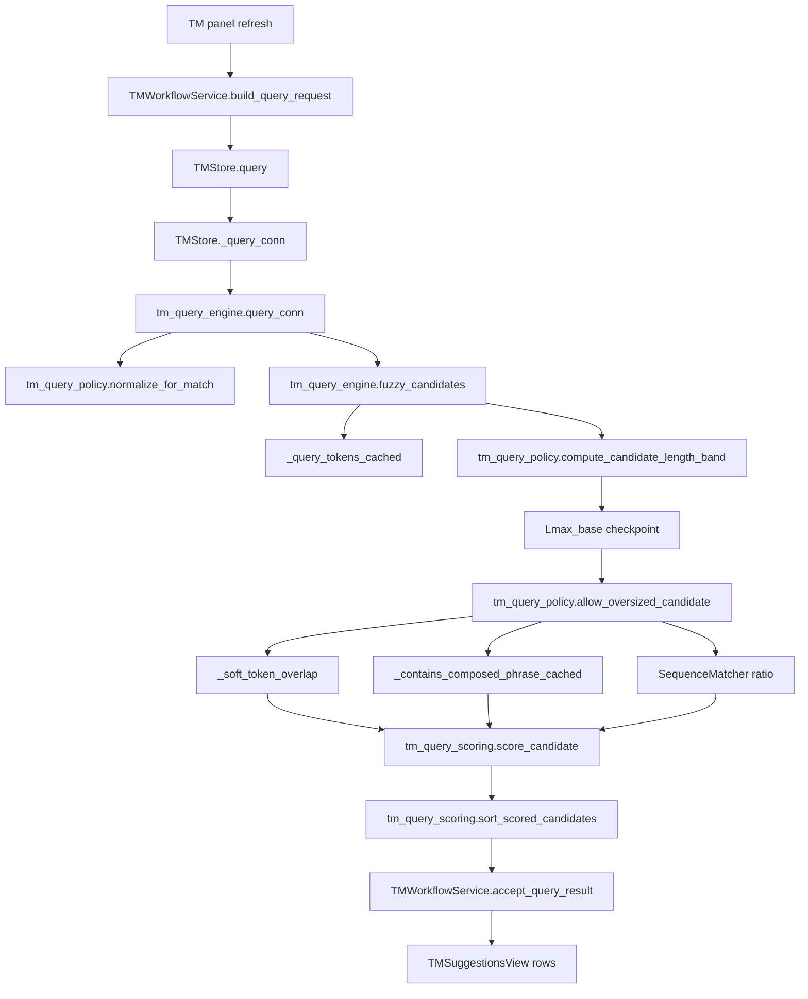

## 9) Dependency Direction Contract

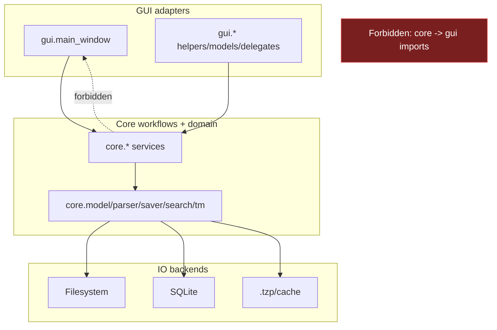

## 10) Programming Model Notes For Contributors

1. Keep business decisions in core service modules, not Qt slots/widgets.
2. Add DTO-first APIs (dataclasses/protocols) for cross-layer boundaries.
3. Keep parser/saver/search/TM changes deterministic and benchmarked.
4. If adding GUI behavior, wire through helper adapters before growing `main_window.py`.
5. Update this document and `docs/reference/module_map.md` when adding or moving ownership.

## 11) Flagged Modules (Document-or-Flag)

Active deep-review entries (see `docs/reference/review_queue.json`):

- FLAGGED_MODULE: translationzed_py/core/preferences.py
  - current behavior: env parsing + normalization + migration orchestration in one module.
  - known limits: high branch density in `_parse_env` reduces readability/change safety.
  - risk notes: intertwined legacy + current key paths can hide regressions.
  - refactor target: split parser/normalizer/migration helpers.
  - tests needed: `tests/test_preferences.py`, `tests/test_preferences_edge_paths.py`,
    `tests/test_preferences_service.py`.

- FLAGGED_MODULE: translationzed_py/core/search_replace_service.py
  - current behavior: search planning, caching policy, replace orchestration in one module.
  - known limits: high branching and wide responsibility surface.
  - risk notes: policy and performance changes are tightly coupled.
  - refactor target: isolate planning/caching/apply helpers.
  - tests needed: `tests/test_search_replace_service.py`,
    `tests/test_search_wave2_equivalence.py`, `tests/test_search_perf_contract.py`.

When a module is flagged in `docs/reference/review_queue.json`, add an explicit marker:

`FLAGGED_MODULE: translationzed_py/<path>.py`

and keep the section factual (current behavior, limits, risk, refactor target, tests).
