# TranslationZed-Py — Architecture Diagrams
_Last updated: 2026-03-04_

This page is the high-level diagram index.
For code-level dependency and extension rules, see `docs/architecture/code_architecture.md`.

Mermaid in this page is the maintained source. Canonical docs render one primary diagram only; do
not add unreferenced alternate source or static copies.

## 1) System Context

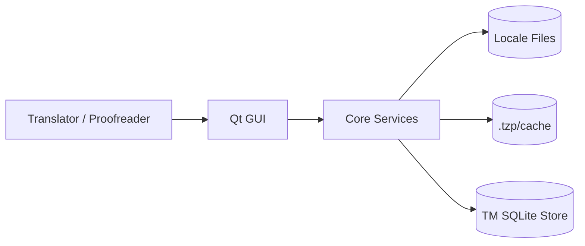

## 2) Layered Architecture

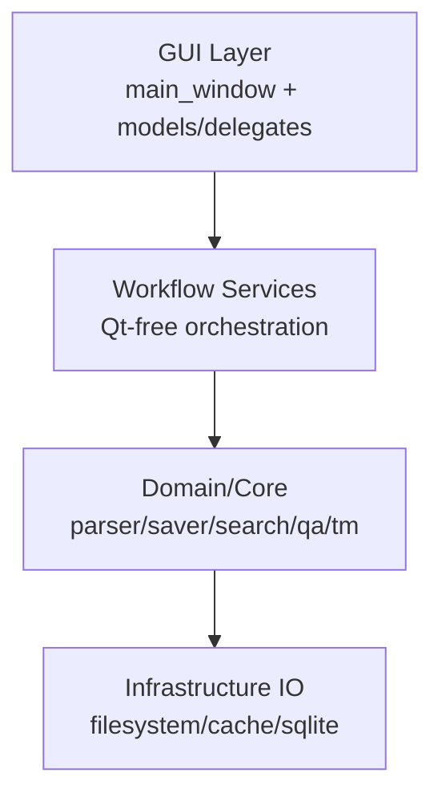

## 3) Core Services Interaction Graph

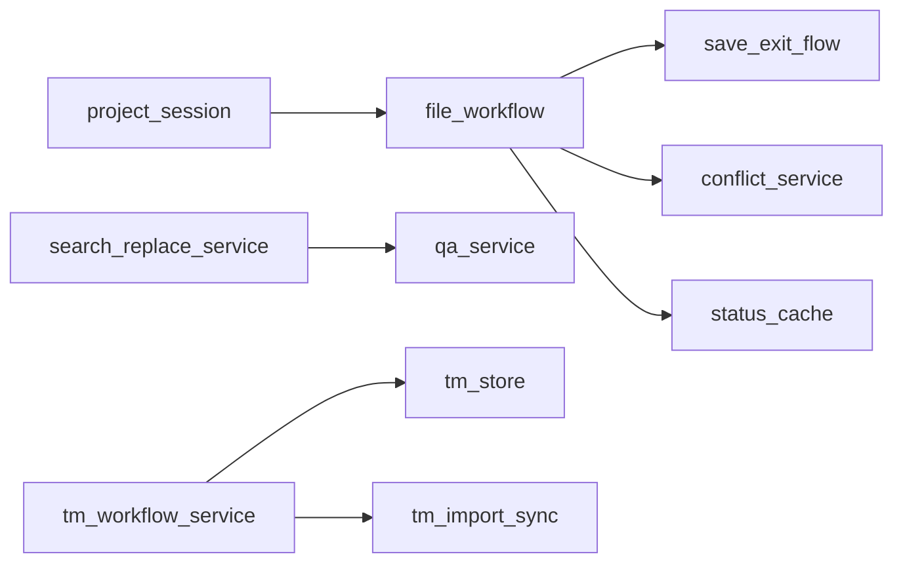

## 4) GUI Adapters/Controllers Interaction Graph

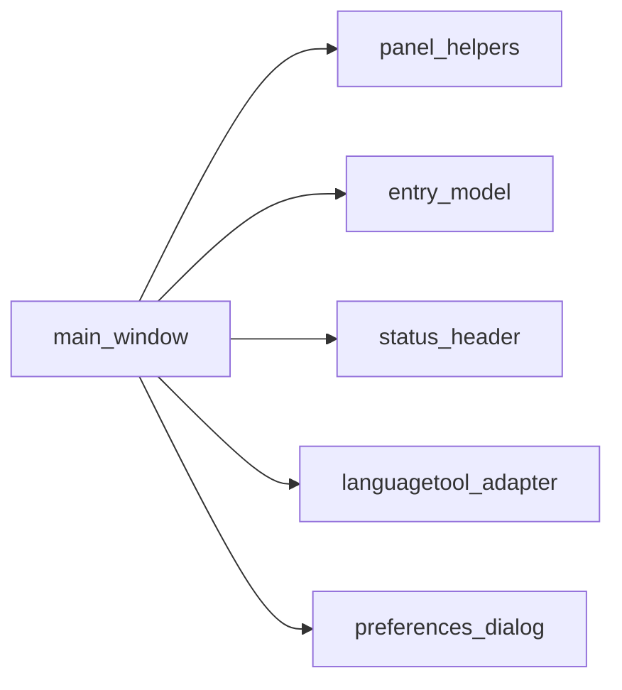

## 5) Save Flow Sequence

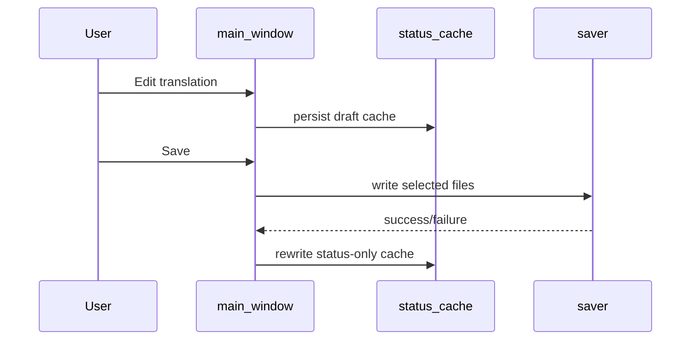

## 6) Open / Parse / Conflict Sequence

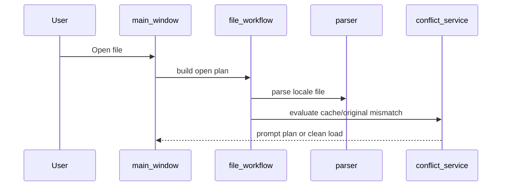

## 7) EN Diff + NEW Insertion Sequence

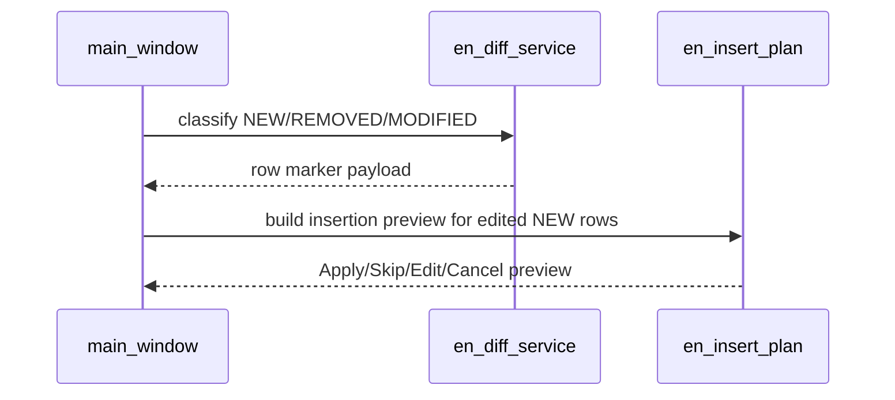

## 8) Status Triage State Machine

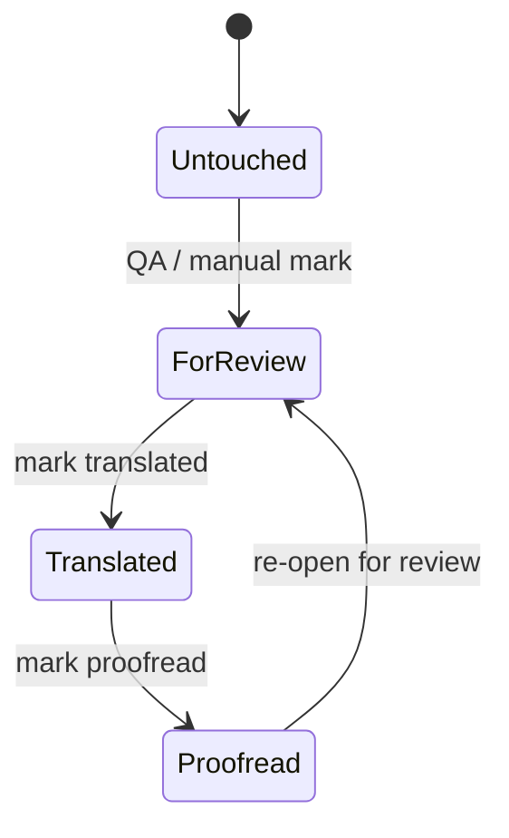

## 9) QA + LanguageTool Pipeline

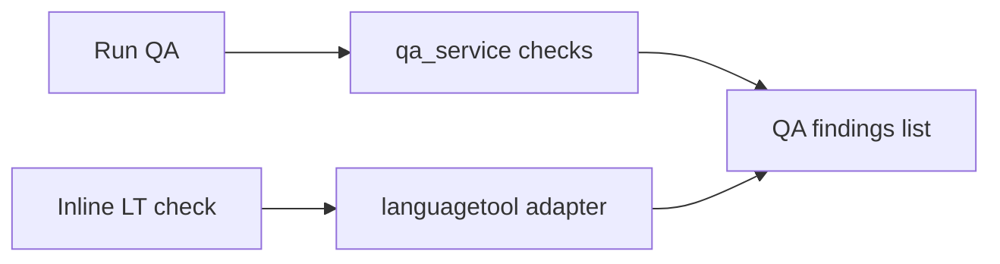

## 10) TM Ranking Query Activity

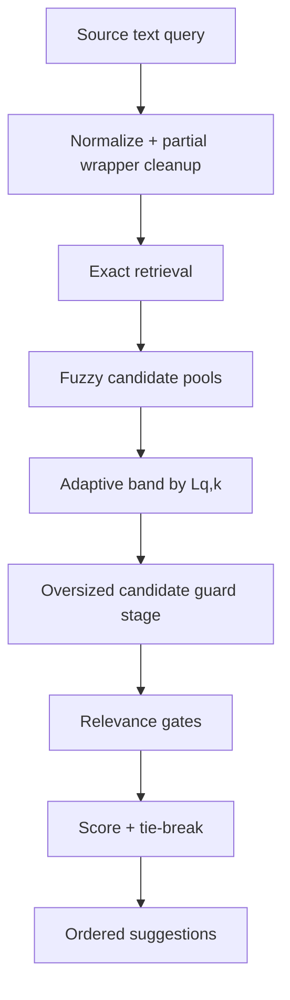

### 10.1 TM Long-Variant Detection Activity

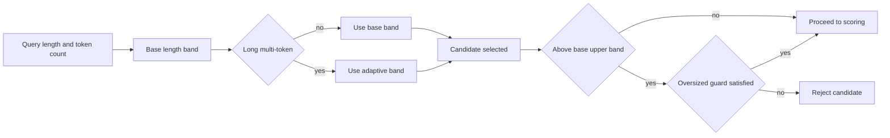

## 11) Verification Pipeline

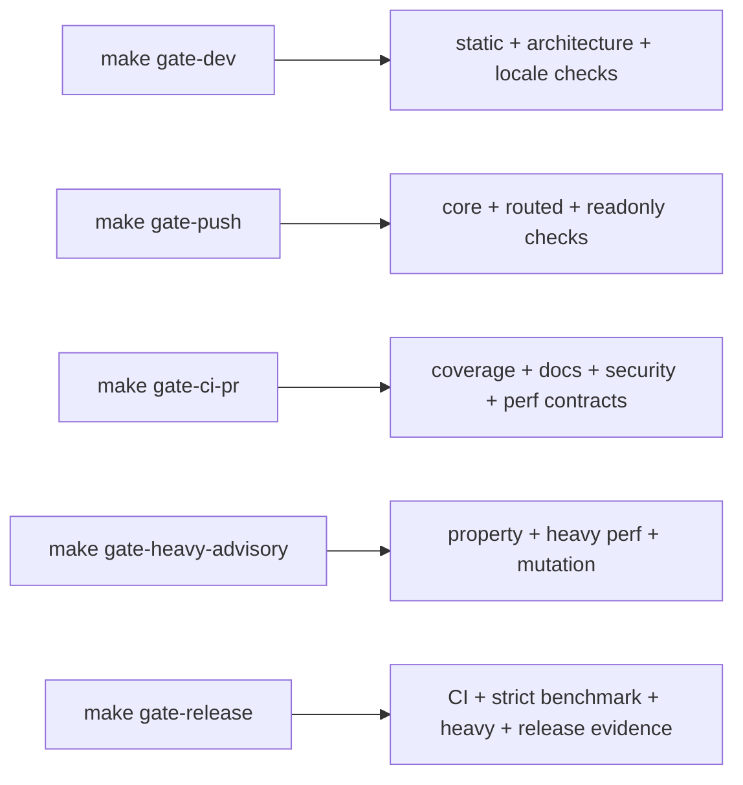

## 12) Module Dependency Map

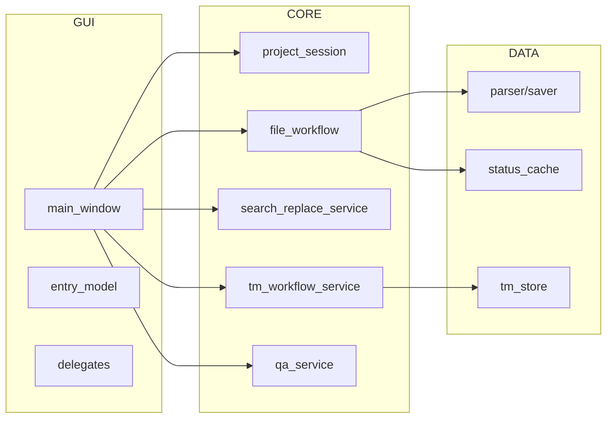

## 13) QA Live Checklist Pipeline

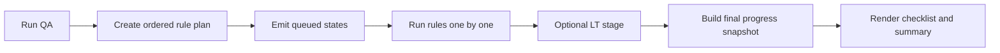

## 14) TM Explainability Delivery

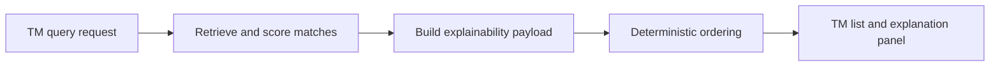

## 15) Crash Recovery Startup Decision

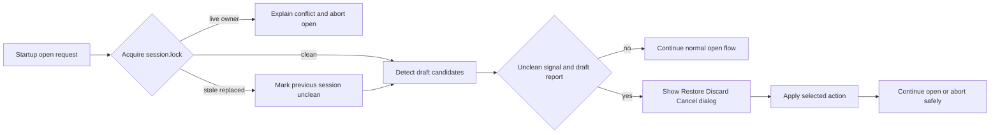
