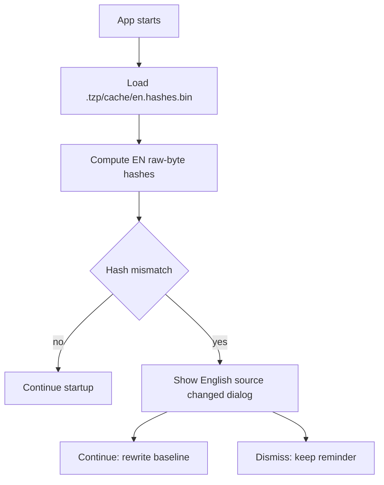
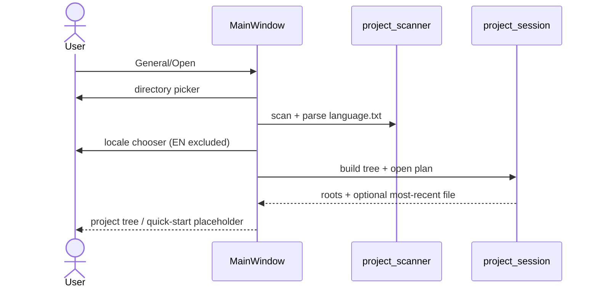
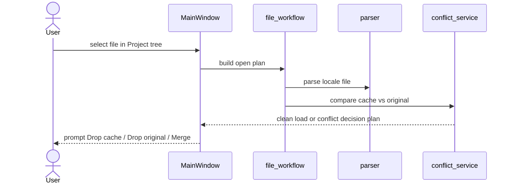
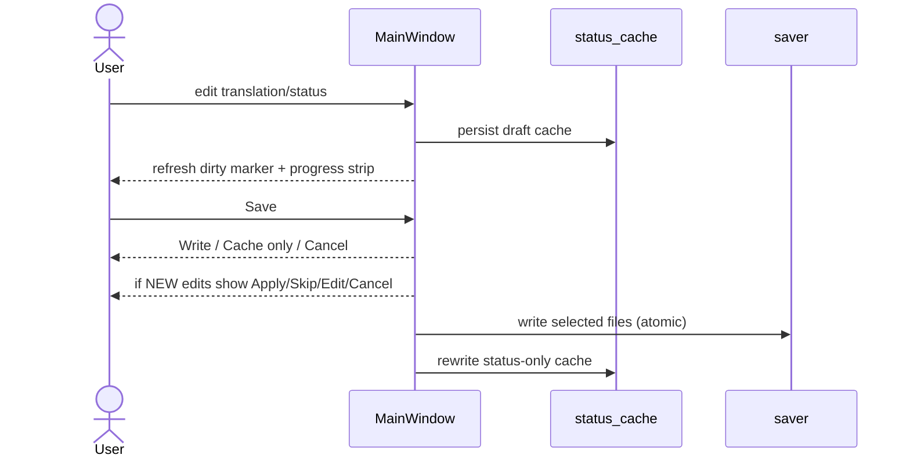
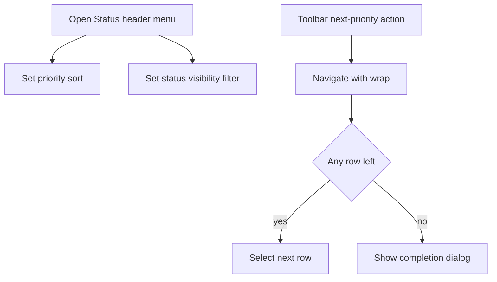
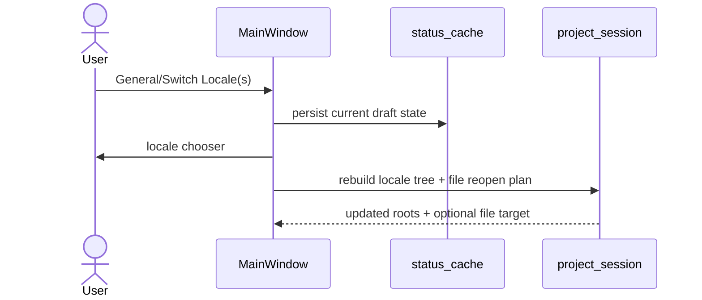
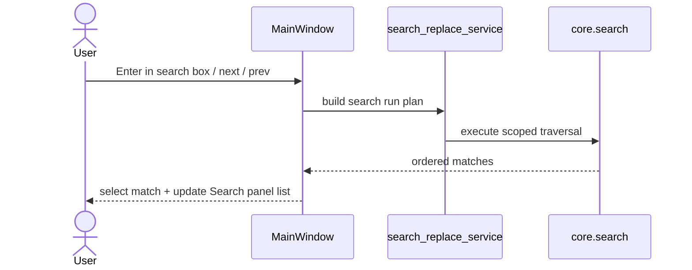
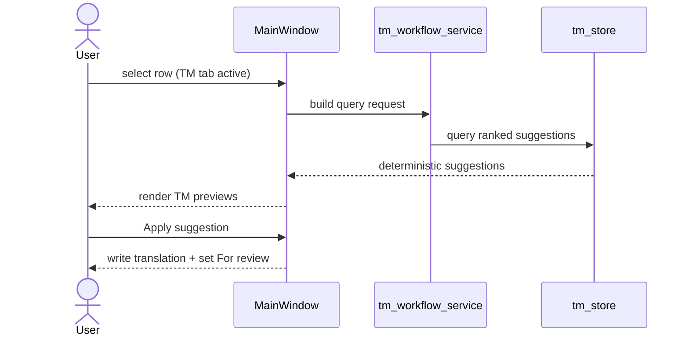
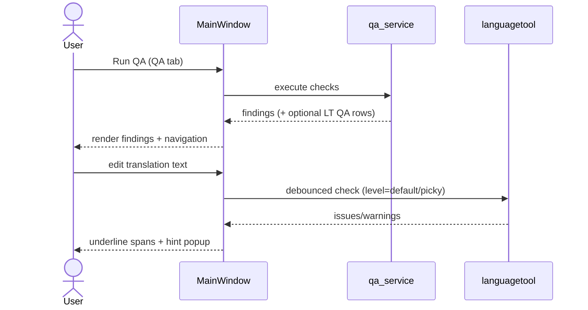

# TranslationZed-Py — Key Flows
_Last updated: 2026-03-01_

This is a derived reference from canonical behavior in:
- `docs/spec/technical.md`
- `docs/ux/use_cases.md`

## 1) Startup EN Hash Check

## 2) Open Project And Select Locales

## 3) Open File + Conflict Scan

## 4) Edit + Save

## 5) Status Triage

## 6) Locale Switch

## 7) Search + Search Panel

## 8) TM Query + Apply

## 9) QA + LanguageTool

