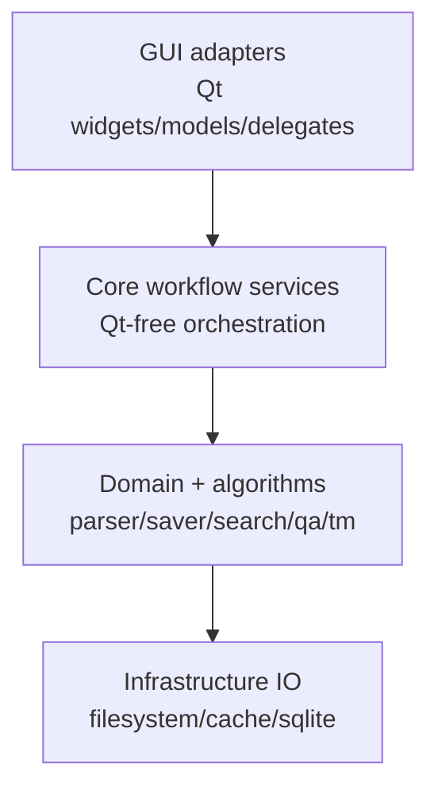
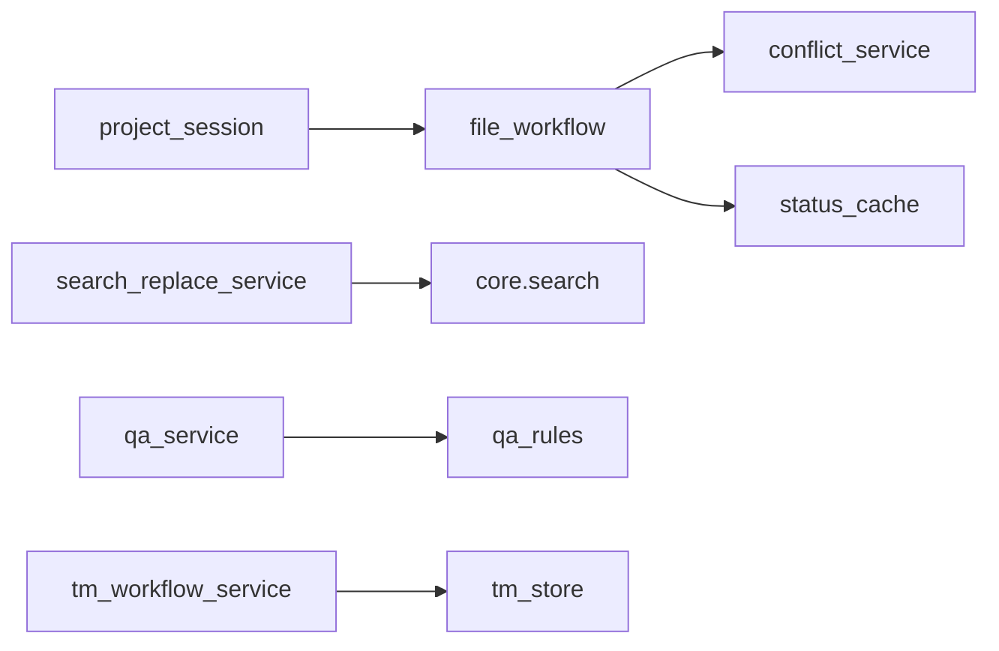

# TranslationZed-Py — Architecture Overview
_Last updated: 2026-03-24_

## 1) Goals

- Keep core workflow logic Qt-free.
- Preserve byte-exact file structure outside translation literals.
- Keep persistence and ranking behavior deterministic.
- Keep GUI responsive for large files and long-running operations.

## 2) Layering Model

Dependency rules:
1. GUI imports core services; core never imports Qt.
2. Non-UI policy decisions belong in core services.
3. GUI remains adapter/orchestrator for rendering, signals, dialogs, and focus state.

## 3) Core Workflow Services (As-Built)

| Service | Responsibility |
|---|---|
| `project_session` | locale/session/tree planning and startup/switch behavior |
| `file_workflow` | open/save sequencing, parse/cache callbacks |
| `conflict_service` | conflict resolution planning and merge/persist policy |
| `search_replace_service` | search/replace planning and row cache policy |
| `preferences_service` | preference normalization and startup root policy |
| `qa_service` | QA finding generation and panel/navigation planning |
| `tm_workflow_service` | TM query/apply/refresh orchestration and diagnostics |
| `render_workflow_service` | render-heavy policy decisions |

## 4) Persistence Contracts

- Draft cache: `.tzp/cache/<locale>/<relative>.bin`.
- EN hash cache: `.tzp/cache/en.hashes.bin`.
- EN diff snapshot: `.tzp/cache/en_diff_snapshot.json`.
- Managed TM imports: `.tzp/tms` by default.

## 5) GUI Responsibilities

- Menu bar contract: `General`, `Edit`, `View`, `Help`.
- Left sidebar tabs: `Project`, `TM`, `Search`, `QA`.
- Project tab includes progress strip above file tree.
- Main table presents one file at a time with status triage controls.
- Detail panel supports full-text source/translation editing flow.

## 6) Replaceability Points

- Parser/saver implementation can evolve behind stable contracts.
- Cache and TM storage backends remain replaceable through service boundaries.
- Search/TM scoring internals may be optimized without behavior drift.

## 7) Conformance Guardrails

- New workflow logic must be added in `translationzed_py/core/*` service modules.
- `translationzed_py/gui/main_window.py` must remain adapter-first.
- Architecture guard (`make arch-check`) is mandatory for structural regressions.

## 8) Diagram Index

See:
- `docs/architecture/diagrams.md` for high-level architecture and flow diagrams.
- `docs/architecture/code_architecture.md` for concrete classes/interfaces/controllers.

## 9) Optional External Consumer Boundary

- This repository is fully operable through terminal and Make alone.
- Optional developer tooling may exist outside this repository and consume the same
  public commands, scripts, and report artifacts.
- Such tooling must remain an external consumer only; it must not be required for
  normal development, CI, or release execution.
