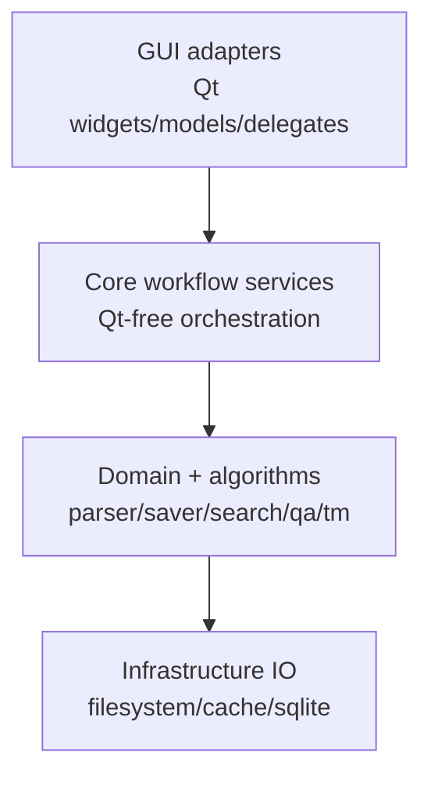
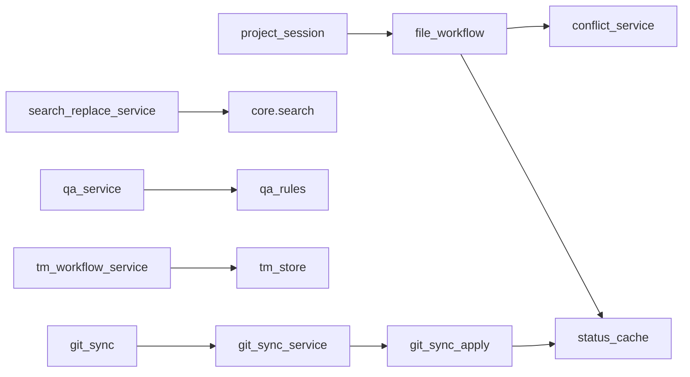

# TranslationZed-Py — Architecture Overview
_Last updated: 2026-07-16_

## 1) Goals

- Keep core workflow logic Qt-free.
- Preserve byte-exact file structure outside translation literals.
- Keep persistence and ranking behavior deterministic.
- Keep GUI responsive for large files and long-running operations.

## 2) Layering Model

Dependency rules:
1. GUI imports core services; core never imports Qt.
2. Non-UI policy decisions belong in core services.
3. GUI remains adapter/orchestrator for rendering, signals, dialogs, and focus state.

## 3) Core Workflow Services (As-Built)

| Service | Responsibility |
|---|---|
| `project_session` | locale/session/tree planning and startup/switch behavior |
| `file_workflow` | open/save sequencing, parse/cache callbacks |
| `conflict_service` | conflict resolution planning and merge/persist policy |
| `search_replace_service` | search/replace planning and row cache policy |
| `preferences_service` | preference normalization and startup root policy |
| `qa_service` | QA finding generation and panel/navigation planning |
| `tm_workflow_service` | TM query/apply/refresh orchestration and diagnostics |
| `render_workflow_service` | render-heavy policy decisions |
| `git_sync` / `git_sync_service` / `git_sync_apply` | local committed EN inspection, immutable preview policy, and cache-only resolved effects |

`locale_creation` remains a partial v1 foundation with staged clone policy. `gui.git_sync_ui` owns
the background local-HEAD check and renders core synchronization plans; integration status is
authoritative in `docs/plan/implementation_active.md`.

## 4) Persistence Contracts

- Draft cache: legacy `file.txt` maps to `.tzp/cache/<locale>/file.bin`; B42 `file.json` maps to
  `.tzp/cache/<locale>/file.json.bin`.
- Workspace snapshot: `.tzp/cache/session.resume.json` (atomic replacement).
- Git synchronization baseline: `.tzp/cache/git_sync_state.json`; staged legacy comment changes
  remain in `.tzp/cache/git_sync_comments.json` until normal explicit Save.
- Live one-writer marker: `.tzp/cache/session.lock` (removed on accepted clean close; stale marker
  activates draft-recovery detection).
- EN hash cache: `.tzp/cache/en.hashes.bin`.
- EN diff snapshot: `.tzp/cache/en_diff_snapshot.json`.
- Managed TM imports: `.tzp/tms` by default.

## 5) GUI Responsibilities

- Menu bar contract: `General`, `Edit`, `View`, `Help`.
- Left sidebar tabs: `Project`, `TM`, `Search`, `QA`.
- Project tab includes progress strip above file tree.
- Main table presents one file at a time with status triage controls.
- Detail panel supports full-text source/translation editing flow.

## 6) Change Boundaries

- Parser/saver/format-dispatch changes must preserve byte, encoding, and format-identity contracts;
  the confirmed B42 boundary is documented in `docs/domain/b42_json_format.md`.
- Cache, session, and TM schema changes require explicit compatibility and migration tests.
- Search/TM internals may be optimized only with deterministic equivalence evidence.
- A flat module is the default. Create a subpackage only when several cohesive modules already share
  a stable boundary and the move removes recurring ownership ambiguity; line count alone is not a
  reason to add nesting.

## 7) Conformance Guardrails

- New workflow logic must be added in `translationzed_py/core/*` service modules.
- `translationzed_py/gui/main_window.py` must remain adapter-first.
- Architecture guard (`make arch-check`) is mandatory for structural regressions.

## 8) Diagram Index

See:
- `docs/architecture/diagrams.md` for high-level architecture and flow diagrams.
- `docs/architecture/code_architecture.md` for concrete classes/interfaces/controllers.

## 9) Optional External Consumer Boundary

- This repository is fully operable through terminal and Make alone.
- Optional developer tooling may exist outside this repository and consume the same
  public commands, scripts, and report artifacts.
- Such tooling must remain an external consumer only; it must not be required for
  normal development, CI, or release execution.
