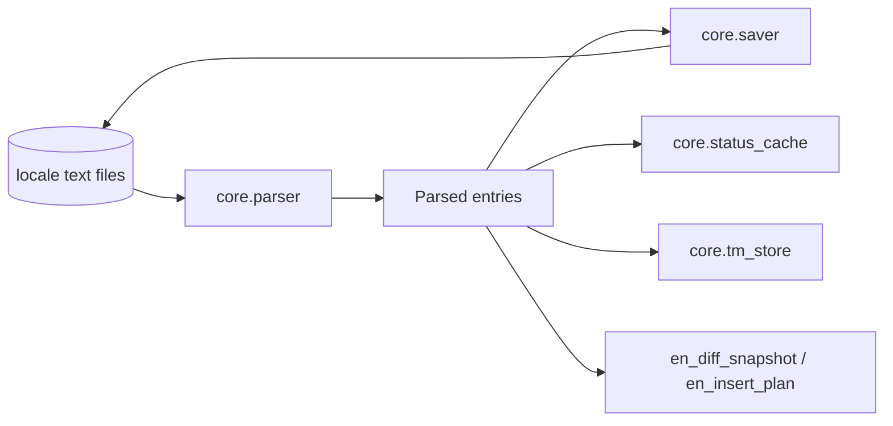
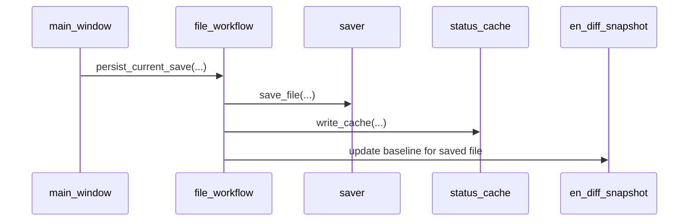
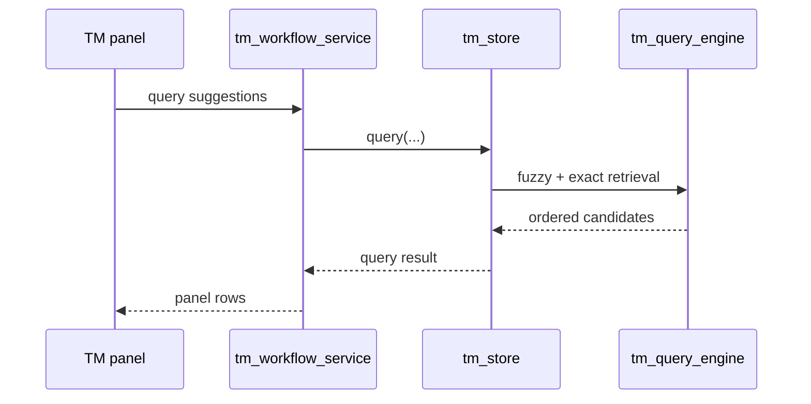

# Core Data/IO API
_Last updated: 2026-03-04_

## 1) Why This Layer Exists

This layer is the deterministic persistence boundary for locale data.

It exists to:
1. parse locale bytes into stable entry structures,
2. apply edits without mutating non-literal bytes,
3. persist cache/snapshot/TM state with deterministic contracts.

## 2) When Not To Use

1. Do not call parser/saver internals from Qt widgets directly; use workflow services (`file_workflow`, `project_session`) as orchestration boundaries.
2. Do not implement UI ordering/interaction policy in this layer.
3. Do not bypass `status_cache`/`en_diff_snapshot` with ad-hoc sidecar files.

## 3) Data Path Overview



## 4) Module Responsibilities

| Module | Responsibility | Hard Invariant |
|---|---|---|
| `parser` | tolerant decode + tokenization + span extraction | preserve source offsets for saver |
| `saver` | span-based patch writer | do not mutate non-literal bytes |
| `status_cache` | per-file draft/status cache | deterministic read/write; no hidden writes |
| `en_diff_snapshot` | EN baseline snapshot persistence | snapshot consistency after save |
| `en_insert_plan` | NEW-key insertion preview/apply planning | EN order + comment dedup |
| `tm_store` + TM query modules | TM persistence + fuzzy ranking | deterministic ordering and score behavior |

## 5) Call-Chain Examples

### 5.1 Open + overlay path

```mermaid
sequenceDiagram
  participant GUI as main_window
  participant FW as file_workflow
  participant PAR as parser
  participant SC as status_cache

  GUI->>FW: prepare_open_file(...)
  FW->>PAR: parse(...)
  FW->>SC: read_cache(...)
  FW-->>GUI: OpenFileResult + overlay payload
```

### 5.2 Save + snapshot refresh path



### 5.3 TM query path



## 6) DTO Boundaries

1. `parser` returns core model entities (`ParsedFile`, `Entry`, status/value metadata).
2. `status_cache` reads/writes deterministic cache payloads; GUI never consumes raw binary directly.
3. EN diff/insertion modules exchange typed planning objects (`ENDiffResult`, `ENInsertPlan`) rather than direct widget structures.
4. TM store returns deterministic row tuples/data contracts consumed by `tm_workflow_service`.

## 7) Failure Modes

1. Decode failure (`parser`): file is rejected for write path; UI surfaces diagnostics.
2. Span mismatch or write failure (`saver`): save aborts; no partial mutation.
3. Cache read/write corruption (`status_cache`): treated as recoverable warning path; core keeps no-write-on-open guarantees.
4. Snapshot or insertion planning conflict: save-time insertion prompt must fail safe (`Skip`/`Cancel` paths).
5. SQLite TM store errors: query/import paths degrade with explicit warning; editing workflow remains functional.

## 8) v0.9 Target Notes

1. TM explainability payload emission is planned in `v0.9` without score/order drift.
2. Crash-recovery report generation may extend cache-read surfaces but must preserve no-write-on-open behavior.
3. Any new data payload must remain deterministic and explicitly schema-documented in canonical specs.

## 9) Change-Safety Focus

When touching this layer, preserve these priorities in order:
1. semantic equivalence (no hidden behavior drift),
2. byte-preserving save invariants for non-literal file regions,
3. deterministic ordering and scores for TM query outputs,
4. bounded cache/memory behavior under large corpora.

## 10) Parser API

::: translationzed_py.core.parser
    options:
      show_root_heading: true
      show_root_toc_entry: true
      members: true
      filters:
        - "!^__"
      show_source: false
      members_order: source

## 11) Saver API

::: translationzed_py.core.saver
    options:
      show_root_heading: true
      show_root_toc_entry: true
      members: true
      filters:
        - "!^__"
      show_source: false
      members_order: source

## 12) Status Cache API

::: translationzed_py.core.status_cache
    options:
      show_root_heading: true
      show_root_toc_entry: true
      members: true
      filters:
        - "!^__"
      show_source: false
      members_order: source

## 13) EN Diff APIs

::: translationzed_py.core.en_diff_service
    options:
      show_root_heading: true
      show_root_toc_entry: true
      members: true
      filters:
        - "!^__"
      show_source: false
      members_order: source

::: translationzed_py.core.en_insert_plan
    options:
      show_root_heading: true
      show_root_toc_entry: true
      members: true
      filters:
        - "!^__"
      show_source: false
      members_order: source

## 14) TM Store API

TM store/query internals are currently in closed review state and treated as stable baseline for `v0.8.0`.

::: translationzed_py.core.tm_store
    options:
      show_root_heading: true
      show_root_toc_entry: true
      members: true
      filters:
        - "!^__"
      show_source: false
      members_order: source
