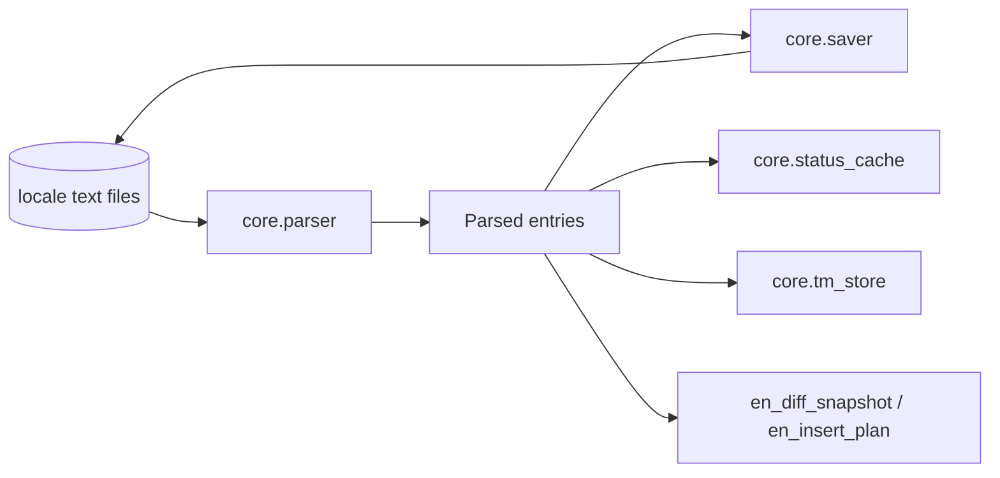

# Core Data/IO API
_Last updated: 2026-03-01_

## 1) Purpose

Data/IO modules implement deterministic persistence and transformation contracts:
1. parse locale files into structured entries,
2. save only literal spans while preserving file structure,
3. persist cache/snapshot/TM data in bounded formats.

## 2) Data Path Overview

## 3) Module Responsibilities

| Module | Responsibility | Hard Invariant |
|---|---|---|
| `parser` | tolerant decode + tokenization + span extraction | preserve source offsets for saver |
| `saver` | span-based patch writer | do not mutate non-literal bytes |
| `status_cache` | per-file draft/status cache | deterministic read/write; no hidden writes |
| `en_diff_snapshot` | EN baseline snapshot persistence | snapshot consistency after save |
| `en_insert_plan` | NEW-key insertion preview/apply planning | EN order + comment dedup |
| `tm_store` + TM query modules | TM persistence + fuzzy ranking | deterministic ordering and score behavior |

## 4) Change-Safety Focus

When touching this layer, preserve these priorities in order:
1. semantic equivalence (no hidden behavior drift),
2. byte-preserving save invariants for non-literal file regions,
3. deterministic ordering and scores for TM query outputs,
4. bounded cache/memory behavior under large corpora.

## 5) Parser API

::: translationzed_py.core.parser
    options:
      show_root_heading: true
      show_root_toc_entry: true
      members: true
      filters:
        - "!^__"
      show_source: false
      members_order: source

## 6) Saver API

::: translationzed_py.core.saver
    options:
      show_root_heading: true
      show_root_toc_entry: true
      members: true
      filters:
        - "!^__"
      show_source: false
      members_order: source

## 7) Status Cache API

::: translationzed_py.core.status_cache
    options:
      show_root_heading: true
      show_root_toc_entry: true
      members: true
      filters:
        - "!^__"
      show_source: false
      members_order: source

## 8) EN Diff APIs

::: translationzed_py.core.en_diff_service
    options:
      show_root_heading: true
      show_root_toc_entry: true
      members: true
      filters:
        - "!^__"
      show_source: false
      members_order: source

::: translationzed_py.core.en_insert_plan
    options:
      show_root_heading: true
      show_root_toc_entry: true
      members: true
      filters:
        - "!^__"
      show_source: false
      members_order: source

## 9) TM Store API

Review status:
1. `translationzed_py/core/tm_store.py` deep-review entry is closed in A15-TM-RF1.
2. Ranking internals are split across:
   1. `tm_store`,
   2. `tm_query_engine`,
   3. `tm_query_policy`,
   4. `tm_query_scoring`,
   5. `tm_query_text`,
   6. `tm_store_support`.

::: translationzed_py.core.tm_store
    options:
      show_root_heading: true
      show_root_toc_entry: true
      members: true
      filters:
        - "!^__"
      show_source: false
      members_order: source
