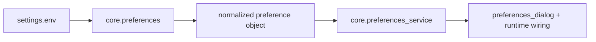

# Core Preferences API
_Last updated: 2026-03-01_

## 1) Purpose

Preferences modules define how runtime settings are:
1. loaded from `.tzp/config/settings.env`,
2. normalized and default-backfilled,
3. exposed as typed values for GUI/core behavior.

Design intent:
1. keep parsing/migration logic in core (not in GUI widgets),
2. keep runtime preference access typed and deterministic,
3. preserve backward compatibility while removing deprecated keys during save.

## 2) Preference Pipeline

## 3) Stability and Review Status

1. `translationzed_py/core/preferences.py` is still flagged for deep review.
2. Use exported normalized values; avoid depending on parser internals.
3. Deprecated key cleanup and default backfill are part of active contract.

## 4) Operational Contracts

1. `preferences.py` is the persistence boundary:
   1. parse env-like text safely,
   2. normalize and backfill defaults,
   3. drop deprecated keys on persist.
2. `preferences_service.py` is the runtime boundary:
   1. resolve effective settings for workflows/UI,
   2. return typed values for callers,
   3. avoid leaking raw env parsing details.
3. GUI adapters should call service-level functions and treat parser internals as unstable while review is open.

## 5) Change-Safety Checklist

When editing preferences behavior:
1. keep key migration deterministic (same input -> same normalized output),
2. keep default-backfill policy explicit in tests,
3. preserve `Document-or-Flag` note if the flagged module is touched,
4. update `docs/spec/technical.md` and `docs/quality/testing_strategy.md` if contracts change.

## 6) Preferences Persistence API

> flagged for deep review: `translationzed_py/core/preferences.py`

::: translationzed_py.core.preferences
    options:
      show_root_heading: true
      show_root_toc_entry: true
      members: true
      filters:
        - "!^__"
      show_source: false
      members_order: source

## 7) Preferences Service API

::: translationzed_py.core.preferences_service
    options:
      show_root_heading: true
      show_root_toc_entry: true
      members: true
      filters:
        - "!^__"
      show_source: false
      members_order: source
