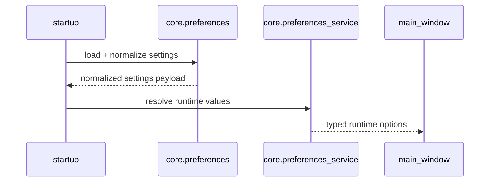
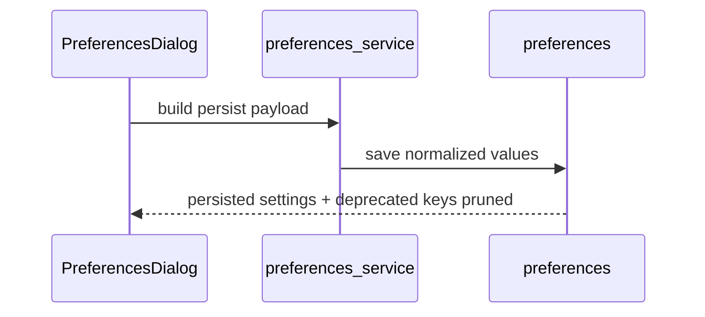

# Core Preferences API
_Last updated: 2026-03-04_

## 1) Why This Layer Exists

This layer centralizes configuration persistence and runtime preference resolution.

It exists to:
1. parse `.tzp/config/settings.env` into normalized settings,
2. enforce default backfill and deprecated-key cleanup deterministically,
3. expose typed runtime preference values to GUI/core adapters.

## 2) When Not To Use

1. Do not parse raw `settings.env` in GUI widgets; use core preference APIs.
2. Do not keep parallel ad-hoc settings files for runtime behavior.
3. Do not bind product logic to parser internals when service-level resolvers already provide typed outputs.

## 3) Preference Pipeline

## 4) Call-Chain Examples

### 4.1 Startup preference load

### 4.2 Preferences dialog save

## 5) DTO Boundaries

1. Persistence layer (`core.preferences`) handles env text parsing and normalization rules.
2. Runtime layer (`core.preferences_service`) maps normalized values into typed behavior controls for workflows/UI.
3. GUI passes user intent and renders values; it does not own migration/default logic.

## 6) Failure Modes

1. Malformed value in settings file:
   - normalize to safe defaults and surface diagnostics.
2. Deprecated key present:
   - remove on save/bootstrap and keep canonical split keys only.
3. Missing required key:
   - backfill deterministic defaults.
4. Save failure:
   - keep in-memory settings intact and surface non-destructive warning.

## 7) Operational Contracts

1. `preferences.py` is the persistence boundary:
   1. parse env-like text safely,
   2. normalize/backfill defaults,
   3. drop deprecated keys on persist.
2. `preferences_service.py` is the runtime boundary:
   1. resolve effective settings for workflows/UI,
   2. return typed values for callers,
3. avoid leaking raw env parser details.

## 8) v0.9 Target Notes

1. QA live checklist and TM workflow UX may add preferences, but parser/service contracts must remain backward-compatible.
2. New keys must follow canonical normalization/backfill/deprecated-prune behavior.
3. UI additions must route through service-level typed values, not raw env parsing.

## 9) Change-Safety Checklist

When editing preferences behavior:
1. keep migration deterministic (same input -> same normalized output),
2. keep split QA auto-mark keys canonical,
3. keep default-backfill and deprecated-prune behavior covered in tests,
4. update `docs/spec/technical.md` and `docs/quality/testing_strategy.md` if contracts change.

## 10) Preferences Persistence API

::: translationzed_py.core.preferences
    options:
      show_root_heading: true
      show_root_toc_entry: true
      members: true
      filters:
        - "!^__"
      show_source: false
      members_order: source

## 11) Preferences Service API

::: translationzed_py.core.preferences_service
    options:
      show_root_heading: true
      show_root_toc_entry: true
      members: true
      filters:
        - "!^__"
      show_source: false
      members_order: source
