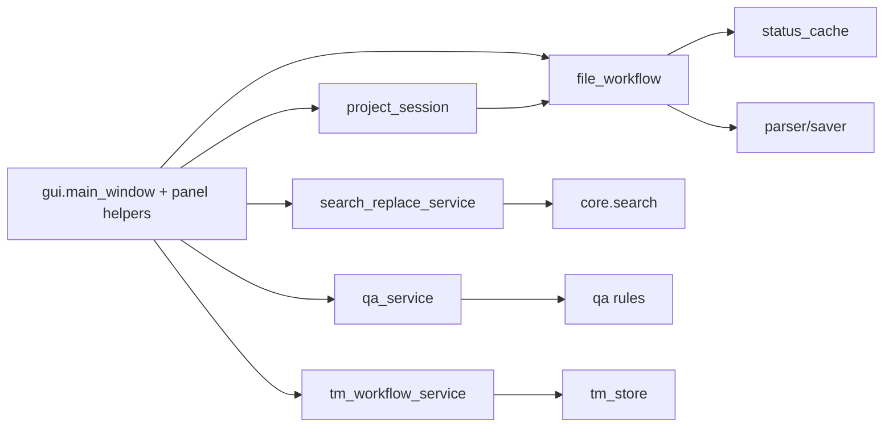
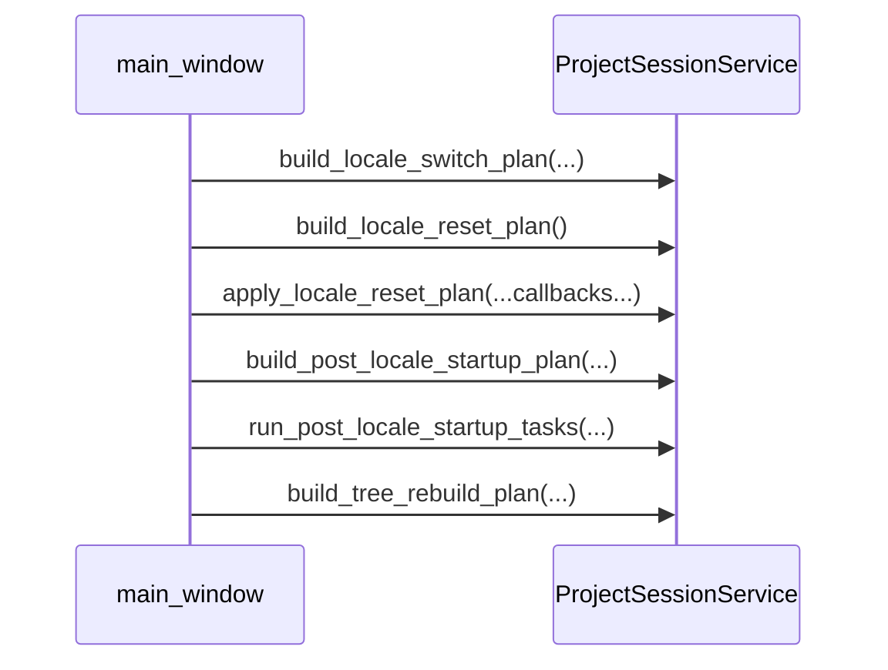
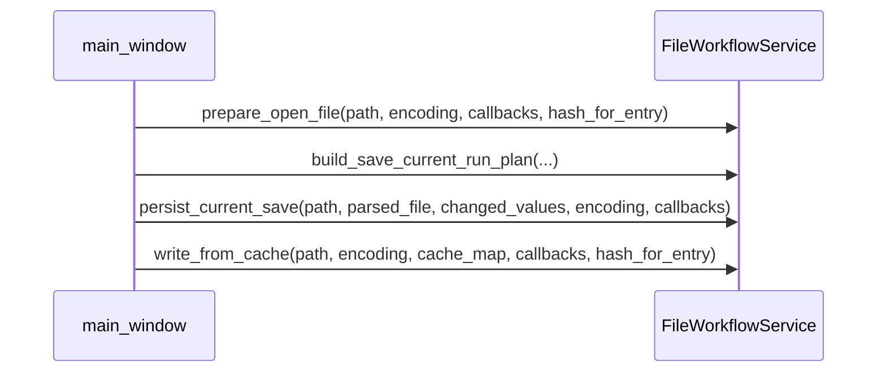
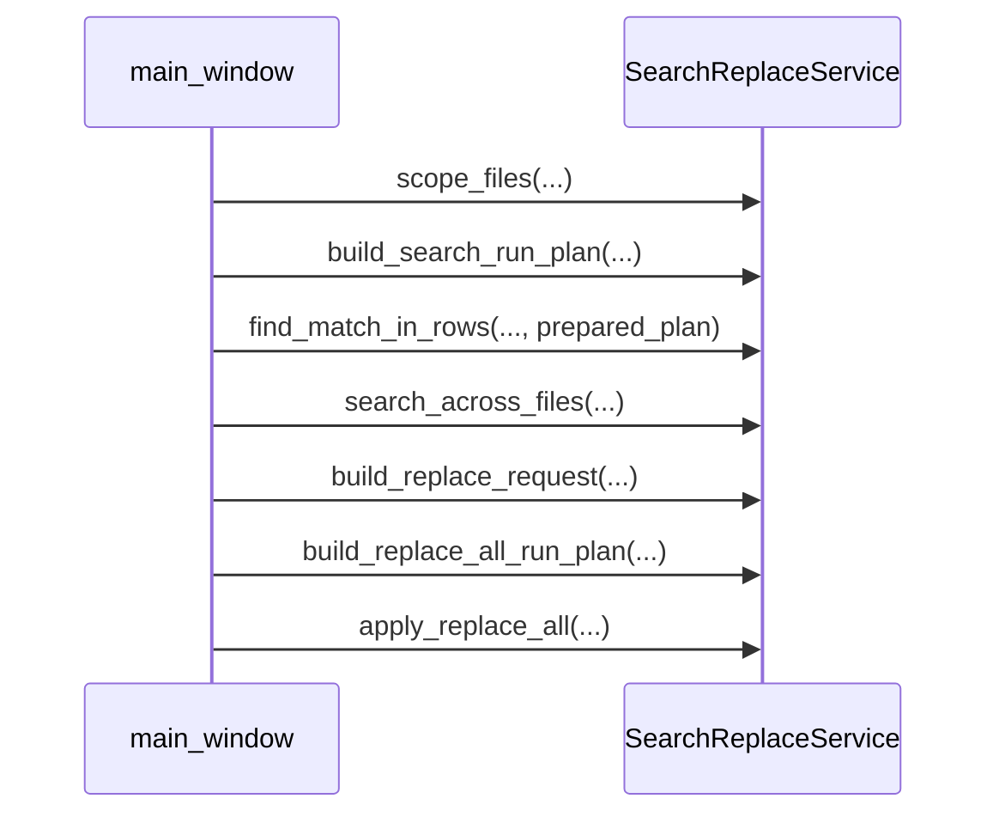

# Core Workflows API
_Last updated: 2026-03-04_

## 1) Why This Layer Exists

Workflow modules coordinate business actions without Qt dependencies. They own:
1. request normalization,
2. policy decisions and plan DTOs,
3. deterministic orchestration of parser/saver/cache/search/QA/TM services.

They do not own widget behavior; GUI adapters call these workflows and render results.

## 2) Orchestration Structure

## 3) Module Guide (Intent + Entry Points)

| Module | Purpose | Typical Entry Points |
|---|---|---|
| `project_session` | session bootstrap and locale/file orchestration | `build_*plan`, `apply_*result` |
| `file_workflow` | open/save/merge/cache write plans | `build_open_*`, `build_save_*`, `apply_*` |
| `search_replace_service` | multi-scope search/replace orchestration | `build_search_plan`, `run_replace_*` |
| `qa_service` | QA finding generation and list planning | `scan_*`, `build_panel_*` |

## 4) Module Contracts: Why and When Not To Use

### 4.1 `project_session`

Why use:
1. normalize locale selection and fallback rules in one place,
2. build deterministic startup/switch/reset/tree-rebuild plans,
3. keep cache migration/orphan detection policy out of GUI slots.

When not to use:
1. do not use for file parsing/saving or cache row overlays (use `file_workflow`),
2. do not use for search/TM/QA orchestration,
3. do not perform direct widget operations here; apply plan callbacks in GUI.

### 4.2 `file_workflow`

Why use:
1. centralize open-file parse/cache-overlay sequence,
2. centralize save-run gating and deterministic write sequencing,
3. keep save-from-cache and parse-boundary error wrapping consistent.

When not to use:
1. do not use for locale/session-tree policy (`project_session` owns that),
2. do not use for replace-all/search traversal policy (`search_replace_service`),
3. do not bypass this layer with ad-hoc parser/cache/saver chains in GUI code.

### 4.3 `search_replace_service`

Why use:
1. one place for scope-file selection and search-run plans,
2. one place for replace request compilation and apply/count policy,
3. deterministic cross-file traversal and anchor/wrap behavior.

When not to use:
1. avoid extending module with unrelated UI concerns,
2. avoid embedding heavy parser/cache IO logic outside provided callback contracts,
3. avoid using internal helpers directly from GUI if service methods already wrap them.

## 5) DTO Boundaries

1. Inputs are plain Python values or dataclasses (no Qt types).
2. Outputs are DTOs/plans that adapters can execute/present.
3. Errors are explicit result states or typed exceptions; UI decides dialogs.

## 6) Call-Chain Examples (Concrete)

### 6.1 Locale switch chain

### 6.2 Open and save current-file chain

### 6.3 Search and replace chain

## 7) Scenario Map (What Calls What)

1. Open/switch locale:
   1. `project_session` builds locale/session plan,
   2. `file_workflow` executes open/load/cache-overlay plans.
2. Save/exit:
   1. `file_workflow` builds save plan,
   2. saver/cache callbacks execute deterministic writes.
3. Search/replace:
   1. `search_replace_service` builds search plans and replace actions,
   2. `core.search` performs matching for selected scope.
4. QA:
   1. `qa_service` scans and returns finding DTOs,
   2. GUI renders findings and navigation actions.

## 8) Failure Modes

1. Plan build failures (invalid scope/input/state) return explicit errors; caller must avoid partial UI mutation.
2. File parse/write callback errors are surfaced by workflow result types and handled in GUI dialog layer.
3. Replace-all failure in one file must keep deterministic per-file result reporting and must not corrupt remaining plan traversal.
4. QA scan failures are isolated by rule where possible; panel still renders completed findings and failure notes.

## 9) v0.9 Target Notes

1. QA workflow orchestration will gain rule-progress snapshots and checklist state transitions.
2. TM workflow orchestration will gain explainability payload delivery to UI adapters.
3. Startup/open orchestration will gain crash-recovery decision routing (`Restore`/`Discard`/`Cancel`).
4. These additions must preserve current `v0.8` deterministic ordering, no-write-on-open, and explicit error-surface contracts.

## 10) Project Session API

::: translationzed_py.core.project_session
    options:
      show_root_heading: true
      show_root_toc_entry: true
      members: true
      filters:
        - "!^__"
      show_source: false
      members_order: source

## 11) File Workflow API

::: translationzed_py.core.file_workflow
    options:
      show_root_heading: true
      show_root_toc_entry: true
      members: true
      filters:
        - "!^__"
      show_source: false
      members_order: source

## 12) Search/Replace Workflow API

Current status:
1. review-queue entry for `translationzed_py/core/search_replace_service.py` is closed in v0.8 lane.
2. strict benchmark and equivalence contracts are green in current baseline.
3. v0.9 target work may expand workflow UX, but this module is not currently flagged.

::: translationzed_py.core.search_replace_service
    options:
      show_root_heading: true
      show_root_toc_entry: true
      members: true
      filters:
        - "!^__"
      show_source: false
      members_order: source

## 13) QA Workflow API

::: translationzed_py.core.qa_service
    options:
      show_root_heading: true
      show_root_toc_entry: true
      members: true
      filters:
        - "!^__"
      show_source: false
      members_order: source
