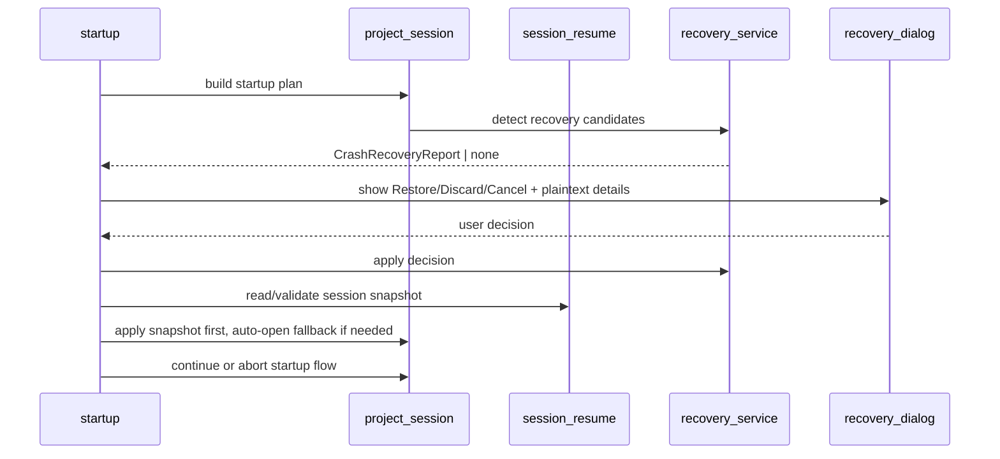

# Crash Recovery Contract (UC-12)
_Updated: 2026-06-23_

## 1) Purpose

Activate crash recovery UX with explicit startup decisions.

## 2) Detection Contract

A recovery flow is triggered when all conditions hold:
1. startup/open project request accepted,
2. recovery-eligible draft cache entries exist,
3. previous session ended uncleanly or cache-draft integrity marker indicates interrupted flow.

## 3) Dialog Contract (Required Actions)

Actions:
1. `Restore`
2. `Discard`
3. `Cancel`

Additional requirement:
- Same window contains plaintext review/details section describing affected files and counts.

## 4) Decision Semantics

1. `Restore`
   - load recovered draft cache state,
   - continue project open flow.
2. `Discard`
   - delete recovery-eligible cache entries (scoped to current project),
   - delete project session snapshot cache file (`session.resume.json`),
   - continue project open flow with clean state.
3. `Cancel`
   - abort open flow,
   - no mutation to original locale files.

### 4.1 Session Resume Startup Contract

1. Session resume snapshot file is project-scoped cache data:
   - `<root>/<cache_dir>/session.resume.json`.
2. Startup post-locale order is fixed:
   - cache scan,
   - session-resume apply,
   - auto-open fallback only when snapshot does not restore file context.
3. Snapshot schema is versioned and strictly validated; invalid or unknown-version payloads are ignored safely.

## 5) Safety Invariants

1. No-write-on-open remains true.
2. Discard must require explicit user action in recovery dialog.
3. Restore/discard operations must be deterministic and idempotent for repeated startup attempts.
4. Session-resume apply must remain startup-only and must not bypass no-write-on-open guarantees.

## 6) Recovery Report Schema

```text
CrashRecoveryReport {
  project_root: str,
  generated_at_ms: int,
  affected_files: list[
    {
      file_path: str,
      locale: str,
      draft_value_count: int,
      status_only_count: int,
      cache_mtime_ns: int,
      warning: str
    }
  ],
  total_files: int,
  total_draft_values: int,
  total_status_only: int
}
```

## 7) Startup Sequence



## 8) Acceptance Scenarios

1. Recovery candidates found, user chooses `Restore`:
   - drafts visible post-open,
   - original files unchanged.
2. Recovery candidates found, user chooses `Discard`:
   - recovery cache removed,
   - project opens without recovered drafts.
3. User chooses `Cancel`:
   - open is aborted,
   - no file/caches unexpectedly mutated.
4. No recovery candidates:
   - no dialog shown.
5. Session snapshot valid:
   - startup restores workspace state/file context first,
   - last-opened fallback is skipped when context is restored.
6. Session snapshot invalid/unknown version:
   - snapshot ignored without exception leakage,
   - startup continues with last-opened fallback behavior.

## 9) Rollback / Failure Handling

1. If discard operation fails for some files, surface warning with failed paths and keep safe abort option.
2. If restore load fails, surface warning and allow retry/discard/cancel decision.
