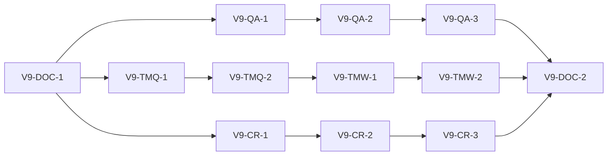

# v0.9.0 Implementation Subtasks (Decision-Complete)
_Last updated: 2026-03-06_

## 1) Purpose

This document defines the decision-complete packet structure for v0.9.
Packets remain dependency-ordered and are used as canonical scope references for
execution history and closure audits.

## 1.1 Execution Status Snapshot (2026-03-06)

1. Completed packets:
   1. `V9-DOC-1`
   2. `V9-QA-1`, `V9-QA-2`, `V9-QA-3`
   3. `V9-TMQ-1`, `V9-TMQ-2`
   4. `V9-TMW-1`, `V9-TMW-2`
   5. `V9-CR-1`, `V9-CR-2`, `V9-CR-3`
2. Active status at time of this snapshot:
   1. no `V9-*` behavior packet is active (packet catalog scope is complete),
   2. milestone-level closure audit (`A28`) is complete and readiness evidence is green.

## 2) Packet Template (Mandatory)

Each packet must include:
1. Goal
2. Inputs/outputs
3. Interfaces/types to add or modify
4. Algorithm/formulas
5. Failure modes
6. Required tests
7. Acceptance criteria
8. Migration/backward-compat notes

## 3) Dependency Graph

## 4) Packet Catalog

## 4.1 V9-DOC-* (pre-code docs alignment)

### V9-DOC-1
- Goal: finalize all v0.9 canonical contracts before runtime edits.
- Inputs: `docs/spec/v0_9/*`, architecture/API docs.
- Outputs: docs-check green baseline.
- Acceptance: `make docs-check` passes.

### V9-DOC-2
- Goal: post-implementation canonical sync and evidence update.
- Inputs: implemented QA/TM/CR behavior + tests.
- Outputs: coherent canonical docs and plan/history/checklists updates.

## 4.2 V9-QA-* (QA live checklist)

### V9-QA-1 — Rule-state model
- Interfaces/types:
  - add `QARuleState` enum and `QARuleProgressRecord` DTO in core QA orchestration boundary.
- Algorithm:
  - ordered rule plan with terminal-state monotonicity.
- Tests:
  - state transition legality and ordering.

### V9-QA-2 — Async execution instrumentation
- Interfaces/types:
  - extend QA async runner payload to include per-rule snapshots.
- Failure modes:
  - LT offline/fallback note handling without global failure.
- Tests:
  - async race and stale-result suppression.

### V9-QA-3 — UI multi-line checklist
- Interfaces/types:
  - QA panel header checklist renderer and updater.
- UX contract:
  - fixed rule order and deterministic text mapping.
- Tests:
  - GUI panel rendering + state updates + re-run reset.

## 4.3 V9-TMQ-* (TM quality/explainability)

### V9-TMQ-1 — Explainability DTO surface
- Interfaces/types:
  - add explainability payload alongside TM match metadata.
- Formula contract:
  - preserve current score equations and caps.
- Tests:
  - payload correctness for exact/fuzzy/long-variant paths.

### V9-TMQ-2 — Determinism guard integration
- Goal:
  - ensure explainability does not change ranking/order.
- Tests:
  - corpus/equivalence/perf contracts unchanged.

## 4.4 V9-TMW-* (TM workflow UX)

### V9-TMW-1 — Triage view upgrades
- Interfaces/types:
  - grouping/sorting view-state contracts in TM panel adapter.
- Acceptance:
  - deterministic base order preserved.

### V9-TMW-2 — Quick action and explanation panel
- Interfaces/types:
  - quick-apply/navigation actions + explanation detail panel contract.
- Tests:
  - keyboard + mouse parity, apply stability under grouped view.

## 4.5 V9-CR-* (Crash recovery UC-12)

### V9-CR-1 — Recovery detection/report service
- Interfaces/types:
  - `CrashRecoveryReport` generation pipeline.
- Tests:
  - detection correctness and report determinism.

### V9-CR-2 — Startup dialog flow
- Interfaces/types:
  - dialog decision result contract (`restore|discard|cancel`).
- UX requirement:
  - plaintext details available in same window.

### V9-CR-3 — Decision application and safety guards
- Algorithm:
  - restore/discard paths are deterministic and idempotent.
- Safety invariants:
  - no-write-on-open unchanged.
- Tests:
  - restore/discard/cancel end-to-end behavior.

## 5) Required Verification Matrix Per Packet Group

1. QA packets:
   - `tests/test_qa_async.py`
   - `tests/test_gui_qa_panel.py`
   - relevant service/adapter tests.
2. TM packets:
   - `tests/test_tm_store.py`
   - `tests/test_tm_ranking_corpus.py`
   - `tests/test_tm_query_perf_contract.py`
   - TM GUI panel tests.
3. Crash packets:
   - project-session/startup helper tests,
   - crash/recovery integration tests,
   - read-only/no-write integrity tests.
4. Docs packets:
   - `make docs-check`.

## 6) Milestone Completion Conditions for v0.9.0

1. All packets `V9-QA-*`, `V9-TMQ-*`, `V9-TMW-*`, `V9-CR-*` accepted.
2. Canonical docs synchronized and docs-check green.
3. Strict verify/verify-ci and release gates pass on release-candidate commit.
