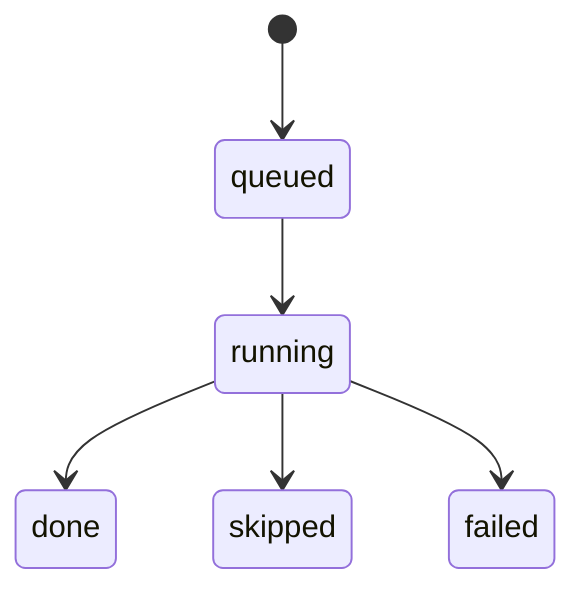

# v0.9.0 QA Live Checklist Contract
_Last updated: 2026-03-04_

## 1) Purpose

Define deterministic QA scan-progress visibility in the left QA panel.

The checklist must communicate exactly what is running and what already
completed, without requiring users to infer progress from a spinner only.

## 2) UI Contract

1. Render a multi-line checklist in QA panel header area.
2. Fixed rule order:
   1. `trailing`
   2. `newlines`
   3. `tokens`
   4. `same_source`
   5. `languagetool`
3. Each row displays:
   - human label,
   - current state,
   - optional note.
4. Checklist is visible during scan and after completion for result review.

## 3) Rule State Machine

### 3.1 States

- `queued`
- `running`
- `done`
- `skipped`
- `failed`

### 3.2 Transitions



### 3.3 Validity Constraints

1. A rule enters `running` at most once per scan run.
2. Terminal states are `done`, `skipped`, `failed`.
3. No transition is allowed from terminal state to non-terminal state in the same run.

## 4) Formal Progress Model

Let:

- $N$ = number of active rules in current scan plan,
- $D(t)$ = count of rules in `done` at time $t$,
- $S(t)$ = count of rules in `skipped` at time $t$,
- $F(t)$ = count of rules in `failed` at time $t$.

Completion ratio:

$$
C(t) = \frac{D(t)+S(t)+F(t)}{N}
$$

Constraints:

$$
0 \le C(t) \le 1
$$

$$
C(t+\Delta t) \ge C(t)
$$

(non-decreasing within one scan run).

## 5) Data Schema

```text
QARuleProgressRecord {
  run_id: str,
  rule_id: "trailing"|"newlines"|"tokens"|"same_source"|"languagetool",
  state: "queued"|"running"|"done"|"skipped"|"failed",
  started_at_ms: int|null,
  ended_at_ms: int|null,
  findings_count: int,
  note: str
}
```

```text
QAScanProgressSnapshot {
  run_id: str,
  file_path: str,
  ordered_rules: list[QARuleProgressRecord],
  completion_ratio: float,
  final_summary: str
}
```

## 6) LanguageTool Failure Semantics

1. LT offline, timeout, or unsupported picky mode must not fail whole QA scan.
2. Such events are represented in LT row note and terminal state:
   - `done` with warning note, or
   - `failed` for LT rule only.
3. Standard QA rule results remain valid regardless of LT rule outcome.

## 7) UX Text Contract

Rule labels:

- `Missing trailing characters`
- `Missing/extra newlines`
- `Protected tokens / placeholders`
- `Translation equals source`
- `LanguageTool`

State text mapping:

- `queued` -> `Queued`
- `running` -> `Running…`
- `done` -> `Completed`
- `skipped` -> `Skipped`
- `failed` -> `Failed`

Final summary format:

- `QA completed: <total_findings> finding(s) across <rules_done>/<N> rules.`

## 8) Acceptance Scenarios

1. All rules enabled, LT enabled:
   - checklist transitions through all five rules,
   - LT row shows final note when fallback/offline condition exists.
2. LT disabled:
   - LT row is `skipped` with deterministic note.
3. Result cap reached before LT:
   - LT row is `skipped` with cap note.
4. Re-run QA:
   - new `run_id`, all rows reset to `queued` before transition.

## 9) Edge Cases

1. No file selected:
   - no checklist run created.
2. Scan interrupted by file change:
   - in-flight run is abandoned; stale snapshot not applied to new file.
3. Rule exception:
   - rule state `failed`, scan continues where safe.
