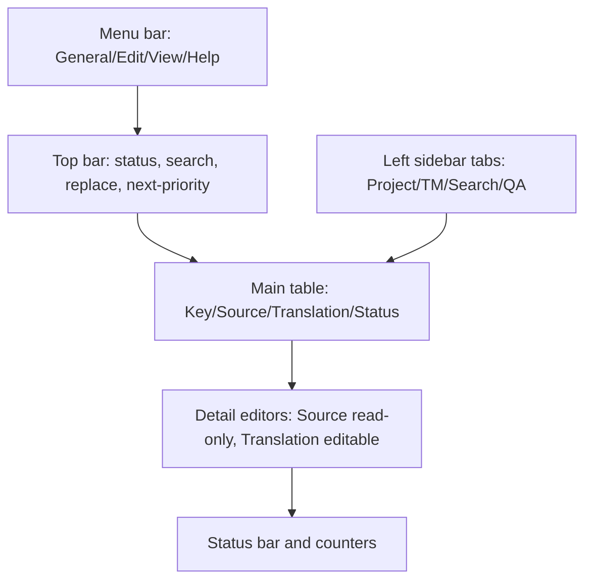

# TranslationZed-Py — Use Cases and UX
_Version 0.8.0 baseline, v0.9.0 target links · 2026-03-04_

## 1) Purpose

This document is the canonical UX index for runtime behavior.

How to use it:
1. Start here for actor model, UI surface map, and UC index.
2. Open linked workflow pages for executable scenarios and diagrams.
3. Treat `docs/spec/technical.md` as normative technical contract when conflicts exist.

## 2) Actors

| ID | Name | Role |
|---|---|---|
| `TR` | Translator | Creates and updates translations. |
| `PR` | Proofreader | Reviews and marks entries. |
| `SYS` | System | TranslationZed-Py runtime behavior. |

## 3) UI Surface Map

## 4) Use-Case Catalog

### 4.1 Project lifecycle and save

| UC | Title | Canonical page |
|---|---|---|
| `UC-00` | Startup EN update check | [`use_cases_project_lifecycle.md#uc-00-startup-en-update-check`](use_cases_project_lifecycle.md#uc-00-startup-en-update-check) |
| `UC-01` | Open project folder | [`use_cases_project_lifecycle.md#uc-01-open-project-folder`](use_cases_project_lifecycle.md#uc-01-open-project-folder) |
| `UC-02` | Switch locale(s) | [`use_cases_project_lifecycle.md#uc-02-switch-locales`](use_cases_project_lifecycle.md#uc-02-switch-locales) |
| `UC-06` | Resolve cache/original conflicts | [`use_cases_project_lifecycle.md#uc-06-resolve-cacheoriginal-conflicts`](use_cases_project_lifecycle.md#uc-06-resolve-cacheoriginal-conflicts) |
| `UC-06b` | Orphan cache warning | [`use_cases_project_lifecycle.md#uc-06b-orphan-cache-warning`](use_cases_project_lifecycle.md#uc-06b-orphan-cache-warning) |
| `UC-08` | First-run default root selection | [`use_cases_project_lifecycle.md#uc-08-first-run-default-root-selection`](use_cases_project_lifecycle.md#uc-08-first-run-default-root-selection) |
| `UC-10a` | Save project | [`use_cases_project_lifecycle.md#uc-10a-save-project-write-original`](use_cases_project_lifecycle.md#uc-10a-save-project-write-original) |
| `UC-10b` | Dirty indicator in file tree | [`use_cases_project_lifecycle.md#uc-10b-dirty-indicator-in-file-tree`](use_cases_project_lifecycle.md#uc-10b-dirty-indicator-in-file-tree) |
| `UC-10c` | EN diff markers and NEW insertion | [`use_cases_project_lifecycle.md#uc-10c-en-diff-markers-and-new-insertion`](use_cases_project_lifecycle.md#uc-10c-en-diff-markers-and-new-insertion) |
| `UC-11` | Exit application | [`use_cases_project_lifecycle.md#uc-11-exit-application`](use_cases_project_lifecycle.md#uc-11-exit-application) |
| `UC-12` | Crash recovery (target: v0.9) | [`use_cases_project_lifecycle.md#uc-12-crash-recovery-deferred`](use_cases_project_lifecycle.md#uc-12-crash-recovery-deferred) |

### 4.2 Editing, statuses, and preferences

| UC | Title | Canonical page |
|---|---|---|
| `UC-03` | Edit translation | [`use_cases_editing_status.md#uc-03-edit-translation`](use_cases_editing_status.md#uc-03-edit-translation) |
| `UC-03b` | Undo/redo | [`use_cases_editing_status.md#uc-03b-undoredo`](use_cases_editing_status.md#uc-03b-undoredo) |
| `UC-03c` | Inline LanguageTool check | [`use_cases_editing_status.md#uc-03c-inline-languagetool-check-detail-editor`](use_cases_editing_status.md#uc-03c-inline-languagetool-check-detail-editor) |
| `UC-04a` | Mark proofread | [`use_cases_editing_status.md#uc-04a-mark-as-proofread`](use_cases_editing_status.md#uc-04a-mark-as-proofread) |
| `UC-04b` | Mark for review | [`use_cases_editing_status.md#uc-04b-mark-as-for-review`](use_cases_editing_status.md#uc-04b-mark-as-for-review) |
| `UC-04c` | Mark translated | [`use_cases_editing_status.md#uc-04c-mark-as-translated`](use_cases_editing_status.md#uc-04c-mark-as-translated) |
| `UC-04d` | Status triage and next-priority navigation | [`use_cases_editing_status.md#uc-04d-status-triage-sortfilter-and-next-priority-navigation`](use_cases_editing_status.md#uc-04d-status-triage-sortfilter-and-next-priority-navigation) |
| `UC-04e` | Progress HUD | [`use_cases_editing_status.md#uc-04e-progress-hud-file-and-locale`](use_cases_editing_status.md#uc-04e-progress-hud-file-and-locale) |
| `UC-07` | Preferences dialog | [`use_cases_editing_status.md#uc-07-preferences-settings`](use_cases_editing_status.md#uc-07-preferences-settings) |
| `UC-09` | Copy/cut/paste | [`use_cases_editing_status.md#uc-09-copy-cut-paste`](use_cases_editing_status.md#uc-09-copy-cut-paste) |

### 4.3 Search, QA, and source reference

| UC | Title | Canonical page |
|---|---|---|
| `UC-05a` | Search and navigate | [`use_cases_search_qa.md#uc-05a-search-and-navigate`](use_cases_search_qa.md#uc-05a-search-and-navigate) |
| `UC-05b` | Search and replace | [`use_cases_search_qa.md#uc-05b-search-and-replace`](use_cases_search_qa.md#uc-05b-search-and-replace) |
| `UC-13m` | QA findings panel | [`use_cases_search_qa.md#uc-13m-qa-findings-side-panel`](use_cases_search_qa.md#uc-13m-qa-findings-side-panel) |
| `UC-13n` | Source reference locale switch | [`use_cases_search_qa.md#uc-13n-source-reference-locale-switch`](use_cases_search_qa.md#uc-13n-source-reference-locale-switch) |

### 4.4 TM workflows

| UC | Title | Canonical page |
|---|---|---|
| `UC-13a` | Side panel mode switch | [`use_cases_tm.md#uc-13a-side-panel-mode-switch`](use_cases_tm.md#uc-13a-side-panel-mode-switch) |
| `UC-13b` | TM suggestions query | [`use_cases_tm.md#uc-13b-tm-suggestions-query`](use_cases_tm.md#uc-13b-tm-suggestions-query) |
| `UC-13c` | Apply TM suggestion | [`use_cases_tm.md#uc-13c-apply-tm-suggestion`](use_cases_tm.md#uc-13c-apply-tm-suggestion) |
| `UC-13d` | Import TM file | [`use_cases_tm.md#uc-13d-import-tm-file`](use_cases_tm.md#uc-13d-import-tm-file) |
| `UC-13e` | Drop-in TM sync | [`use_cases_tm.md#uc-13e-drop-in-tm-sync`](use_cases_tm.md#uc-13e-drop-in-tm-sync) |
| `UC-13f` | Resolve pending imported TMs | [`use_cases_tm.md#uc-13f-resolve-pending-imported-tms`](use_cases_tm.md#uc-13f-resolve-pending-imported-tms) |
| `UC-13g` | Export TMX | [`use_cases_tm.md#uc-13g-export-tmx`](use_cases_tm.md#uc-13g-export-tmx) |
| `UC-13h` | Rebuild project TM | [`use_cases_tm.md#uc-13h-rebuild-project-tm-selected-locales`](use_cases_tm.md#uc-13h-rebuild-project-tm-selected-locales) |
| `UC-13i` | TM filters | [`use_cases_tm.md#uc-13i-tm-filters`](use_cases_tm.md#uc-13i-tm-filters) |
| `UC-13j` | Manage imported TMs in preferences | [`use_cases_tm.md#uc-13j-manage-imported-tms-in-preferences`](use_cases_tm.md#uc-13j-manage-imported-tms-in-preferences) |
| `UC-13k` | TM diagnostics | [`use_cases_tm.md#uc-13k-tm-diagnostics`](use_cases_tm.md#uc-13k-tm-diagnostics) |

## 5) Cross-Cutting UX Invariants

1. UI stays responsive under long operations; progress is always visible.
2. Core policy remains outside Qt widget code.
3. Status progression and save semantics are deterministic.
4. LanguageTool and QA are non-blocking and explainable in UI.
5. Source and Translation workflows preserve full-text editing behavior.

## 6) Related Canonical Docs

1. `docs/spec/technical.md`
2. `docs/architecture/code_architecture.md`
3. `docs/architecture/flows.md`
4. `docs/quality/testing_strategy.md`
5. `docs/spec/v0_9/overview.md` (target behavior packets for upcoming implementation)
