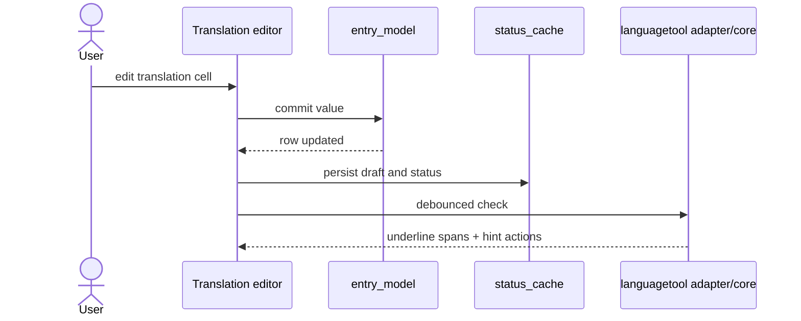
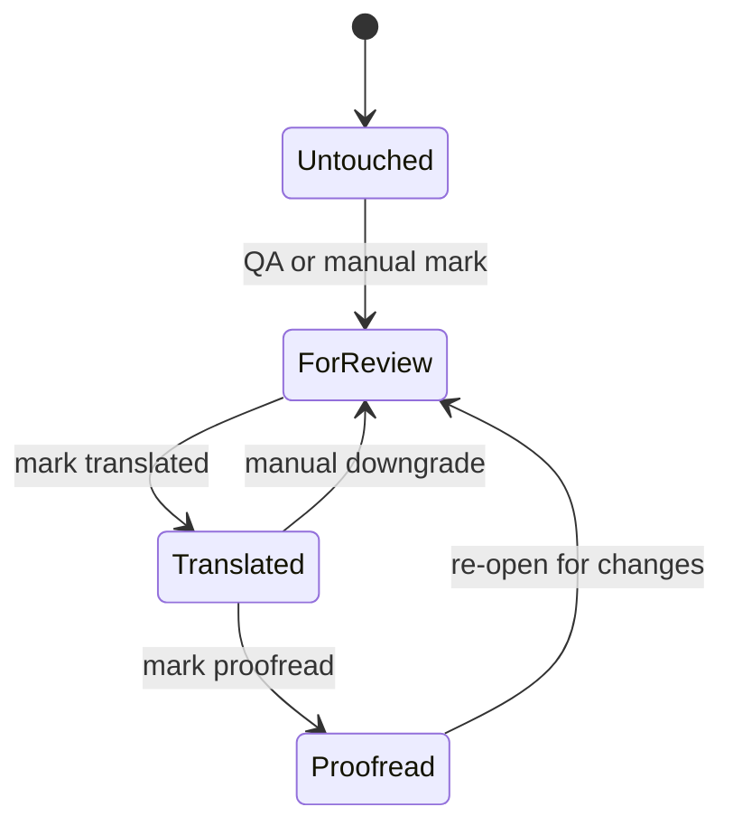

# UX Use Cases — Editing, Statuses, and Preferences
_Last updated: 2026-03-08_

## 1) Editing and Inline Feedback Flow

## 2) Status State Machine

## UC-03 Edit Translation

| Field | Value |
|---|---|
| Goal | Modify one translation value in-place. |
| Trigger | Double-click or `Enter` on Translation cell. |
| Success | Inline editor commit updates model, sets dirty state, writes cache, and advances focus. |
| Post-condition | Status remains unchanged unless explicit status action is taken. |

## UC-03b Undo/Redo

| Field | Value |
|---|---|
| Goal | Revert or re-apply recent value/status operations. |
| Trigger | `Edit -> Undo` (`Ctrl+Z`) or `Edit -> Redo` (`Ctrl+Y`). |
| Success | Apply command stack transition and refresh table/status line state. |

## UC-03c Inline LanguageTool Check (Detail Editor)

| Field | Value |
|---|---|
| Goal | Non-blocking grammar/spell feedback while editing. |
| Trigger | Detail editor text changes (debounced). |
| Success | Stale responses dropped; current issues underlined; click opens hint popup with suggested replacements. |
| Indicator states | `checking`, `issues:N`, `ok`, `offline`, `picky unsupported (default used)`. |
| Contract | `LT_PICKY_MODE=true` uses LT `level=picky`; fallback to `level=default` is warning-only. |

## UC-04a Mark as Proofread

| Field | Value |
|---|---|
| Goal | Set selected rows to Proofread. |
| Trigger | `Ctrl+P` or status action. |
| Success | Status switches to Proofread and row palette updates. |

## UC-04b Mark as For Review

| Field | Value |
|---|---|
| Goal | Set selected rows to For review. |
| Trigger | `Ctrl+U` or status action. |
| Success | Status switches to For review and row palette updates. |

## UC-04c Mark as Translated

| Field | Value |
|---|---|
| Goal | Set selected rows to Translated. |
| Trigger | `Ctrl+T` or status action. |
| Success | Status switches to Translated and row palette updates. |

## UC-04d Status Triage Sort/Filter and Next-Priority Navigation

| Field | Value |
|---|---|
| Goal | Prioritize unfinished rows in current file. |
| Trigger | Status header dropdown or next-priority toolbar action. |
| Success | Sort order `Untouched -> For review -> Translated -> Proofread`; visibility filters by status; next-priority navigation wraps and shows completion dialog when exhausted. |
| Persistence | Runtime-only; resets on reopen/restart. |

## UC-04e Progress HUD (File and Locale)

| Field | Value |
|---|---|
| Goal | Keep motivating progress visible without side-panel clutter. |
| Trigger | File open, status edit, row refresh events. |
| Success | `Project` tab shows locale and current-file segmented bars with `T:%` and `P:%` values; locale aggregation remains non-blocking. |
| Invariant | Proofread percent is separate from translated percent. |

## UC-07 Preferences (Settings)

| Field | Value |
|---|---|
| Goal | Configure behavior without overloading top toolbar. |
| Trigger | `General -> Preferences...` |
| Success | Grouped tabs: `General`, `Search and Replace`, `QA`, `LanguageTool`, `TM`, `View`; advanced sections in `QA`/`LanguageTool`/`TM`/`View` are collapsed by default; apply persists to `.tzp/config/settings.env`. |
| Note | QA-side LT settings remain in `QA` tab; editor LT settings remain in `LanguageTool` tab. |

## UC-09 Copy, Cut, Paste

| Field | Value |
|---|---|
| Goal | Support efficient clipboard editing behavior. |
| Trigger | `Edit` menu actions or standard shortcuts. |
| Success | Row copy emits tab-delimited row payload; cell copy emits one cell; cut/paste are limited to Translation field. |
