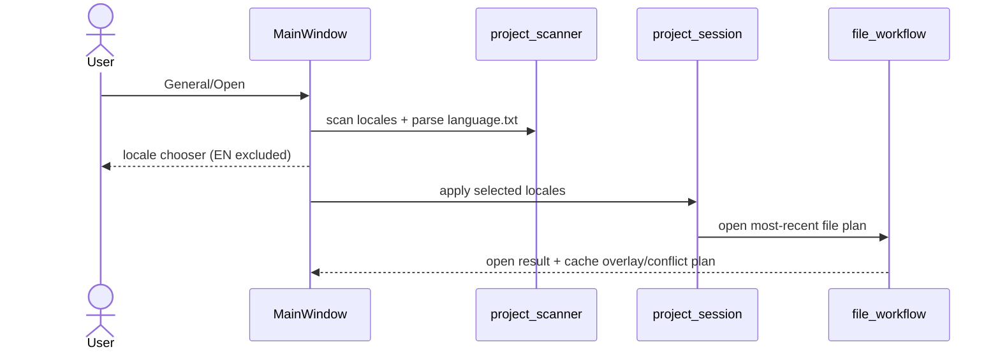
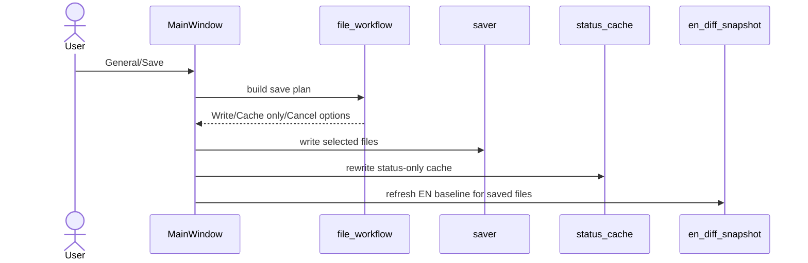

# UX Use Cases — Project Lifecycle and Save
_Last updated: 2026-03-01_

## 1) Open and Switch Lifecycle

## 2) Save and Exit Lifecycle

## UC-00 Startup EN Update Check

| Field | Value |
|---|---|
| Goal | Detect EN source drift before normal work starts. |
| Trigger | Startup after previously opened project. |
| Success | Load EN hash cache, recompute hashes, prompt on mismatch, then continue or defer reset. |
| Post-condition | EN baseline is either refreshed or intentionally deferred. |

## UC-01 Open Project Folder

| Field | Value |
|---|---|
| Goal | Open a Project Zomboid translations root and choose locales. |
| Trigger | `General -> Open...` |
| Success | Scan locale dirs, parse `language.txt`, show locale chooser, build `Project` tree, open most-recent file when available. |
| Alternate | Unsaved drafts are auto-persisted to cache before root switch. |
| Post-condition | Selected locales are active and window title reflects root path. |

## UC-02 Switch Locale(s)

| Field | Value |
|---|---|
| Goal | Re-target active locale set without reopening project manually. |
| Trigger | `General -> Switch Locale(s)...` |
| Success | Persist drafts to cache, run chooser again, rebuild tree and reopen candidate file. |
| Post-condition | New locale set becomes active. |

## UC-06 Resolve Cache/Original Conflicts

| Field | Value |
|---|---|
| Goal | Resolve mismatch between cached drafts and changed originals. |
| Trigger | File open or save path conflict detection. |
| Success | Modal decision: `Drop cache`, `Drop original`, or `Merge` with per-row explicit choices. |
| Constraint | Normal editing and file switching stay disabled until decision completes. |

## UC-06b Orphan Cache Warning

| Field | Value |
|---|---|
| Goal | Prevent silent drift from cache files that no longer map to source files. |
| Trigger | Locale selection applied on open/switch. |
| Success | Show warning with `Purge` or `Dismiss`; only detected orphan files are removed on purge. |

## UC-08 First-Run Default Root Selection

| Field | Value |
|---|---|
| Goal | Capture default translations root for CLI-less startup. |
| Trigger | App launch without CLI project and no stored default root. |
| Success | Blocking root chooser saves default and proceeds startup. |

## UC-10a Save Project (Write Original)

| Field | Value |
|---|---|
| Goal | Persist edited locale files safely. |
| Trigger | `General -> Save` (`Ctrl+S`). |
| Success | Prompt `Write / Cache only / Cancel`, optional per-file selection, atomic writes, cache rewrite, success timestamp. |
| User clarity | Save prompt explicitly states that drafts are auto-saved to cache by default while editing. |
| Invariant | Deselected files remain cache-only and are not written. |

## UC-10c EN Diff Markers and NEW Insertion

| Field | Value |
|---|---|
| Goal | Surface EN deltas and insert edited virtual `NEW` rows deterministically. |
| Trigger | File open/refresh and save with edited virtual `NEW` rows. |
| Success | Mark `NEW/REMOVED/MODIFIED`, prompt `Apply / Skip / Edit / Cancel`, preserve EN order and comment dedup rules. |
| Invariant | `REMOVED` remains marker-only; no auto-delete. |

## UC-10b Dirty Indicator in File Tree

| Field | Value |
|---|---|
| Goal | Show unsaved state in project tree. |
| Trigger | Any edit that sets file dirty. |
| Success | File row gets leading dirty marker and clears after successful save. |

## UC-11 Exit Application

| Field | Value |
|---|---|
| Goal | Exit without losing draft work. |
| Trigger | Window close or `General -> Exit`. |
| Success | If drafts exist and prompt enabled: `Write / Cache only / Cancel`; otherwise cache-only exit. |
| Post-condition | File handles released and caches persisted per policy. |

## UC-12 Crash Recovery

| Field | Value |
|---|---|
| Goal | Ensure startup recovery decisions are explicit and deterministic. |
| Shipped baseline (v0.8) | Recovery is cache-based only (`.tzp/cache`); dedicated restore/discard startup dialog is not active in released v0.8 builds. |
| Current `dev` behavior (v0.9 implementation) | Startup dialog with `Restore`, `Discard`, `Cancel`, plaintext details, and deterministic decision application guards. |
| Normative spec | `docs/spec/v0_9/crash_recovery_uc12.md` |
