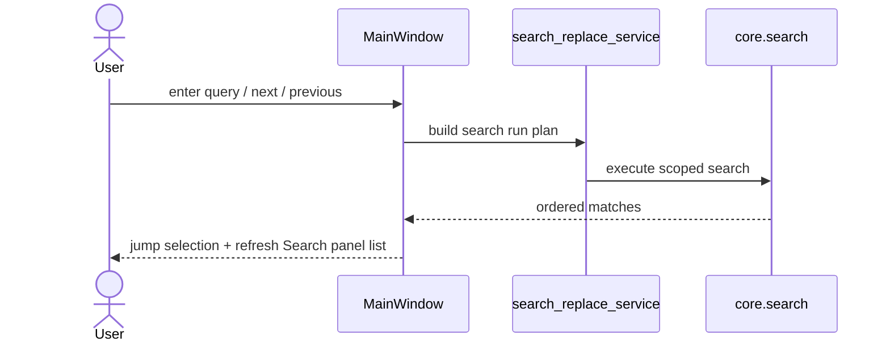
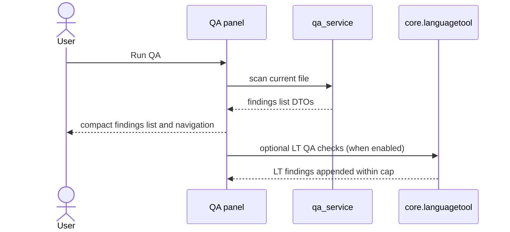

# UX Use Cases — Search, Replace, QA, and Source Reference
_Last updated: 2026-03-01_

## 1) Search and Replace Flow

## 2) QA Flow

## UC-05a Search and Navigate

| Field | Value |
|---|---|
| Goal | Locate matching entries quickly within active scope. |
| Trigger | `Enter` in search box, `F3`, `Shift+F3`. |
| Success | Search selects first/next/previous match, opens next file when needed, and updates Search panel result list. |
| Scope | Uses selected search scope and regex toggle. |

## UC-05b Search and Replace

| Field | Value |
|---|---|
| Goal | Perform scoped replacement safely across rows/files. |
| Trigger | Replace mode enabled in top bar. |
| Success | Supports single replace and replace-all in configured scope; regex capture replacement allowed; empty-match regex guarded to one replacement per cell; Search sidebar and toolbar controls stay synchronized. |
| Safety | Replace-all requires explicit confirmation summary for FILE, LOCALE, and POOL scopes when matches exist. |

## UC-13m QA Findings Side Panel

| Field | Value |
|---|---|
| Goal | Display actionable QA findings and provide deterministic navigation. |
| Trigger | QA panel open or QA refresh. |
| Success | Findings render as compact row labels; selection jumps to file/row; explicit empty state shown when no findings. |
| Navigation | `F8` next and `Shift+F8` previous with wrap and `QA i/n` status hint. |
| Checks | Active checks: trailing/newline, optional tokens and same-source, optional LT findings. |

## UC-13n Source Reference Locale Switch

| Field | Value |
|---|---|
| Goal | Switch Source-column reference locale without reloading project. |
| Trigger | Source header dropdown locale selection. |
| Success | Keep the requested source locale selected, refresh source column values, invalidate source-search row cache, rerun search/TM adapter refresh for current context, and keep the Source column empty when the matching reference file is missing. |
| Persistence | `SOURCE_REFERENCE_MODE` in settings. |
