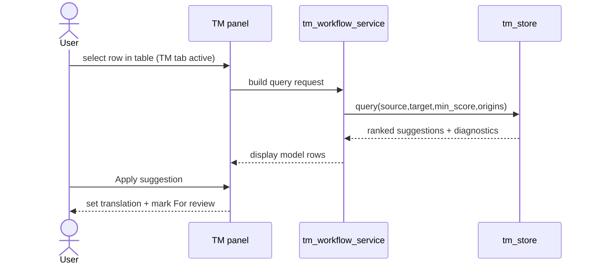
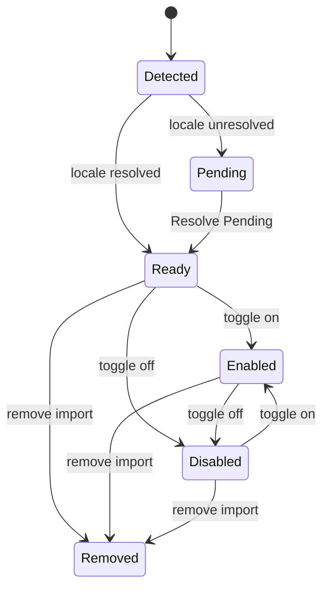

# UX Use Cases — Translation Memory
_Last updated: 2026-03-01_

## 1) TM Query and Apply Flow

## 2) TM Import Lifecycle

## UC-13a Side Panel Mode Switch

| Field | Value |
|---|---|
| Goal | Switch left sidebar mode with minimal friction. |
| Trigger | Click `Project`, `TM`, `Search`, or `QA`. |
| Success | Stack switches mode, width/visibility are preserved, and panel-specific refresh behavior executes. |
| Startup | The app always starts on `Project`; TM activation work begins only after an explicit `TM` click. |

## UC-13b TM Suggestions Query

| Field | Value |
|---|---|
| Goal | Present ranked TM neighbors for selected row context. |
| Trigger | TM tab active and row selection changes. |
| Success | Async query returns exact-first deterministic ranked results with diagnostics and stale-response suppression. |
| Recall contract | Near neighbors remain visible at lower thresholds; substring-only one-token noise is suppressed. |

## UC-13c Apply TM Suggestion

| Field | Value |
|---|---|
| Goal | Apply selected TM suggestion quickly. |
| Trigger | Double-click suggestion or press `Apply`. |
| Success | Write suggestion to Translation cell, set status to For review, persist through normal edit pipeline. |

## UC-13d Import TM File

| Field | Value |
|---|---|
| Goal | Import supported TM file formats into managed TM store. |
| Trigger | `General -> Preferences -> TM -> Import TM...` |
| Success | Copy file into managed folder, resolve locale pair, import units as `origin=import`, report counts/errors. |
| Formats | `.tmx`, `.xliff`, `.xlf`, `.po`, `.pot`, `.csv`, `.mo`, `.xml`, `.xlsx`. |

## UC-13e Drop-In TM Sync

| Field | Value |
|---|---|
| Goal | Auto-sync files added/changed/removed in managed TM import folder. |
| Trigger | TM panel activation. |
| Success | Scan and sync import registry; unresolved mappings stay pending; failed imports remain excluded from query results. |

## UC-13f Resolve Pending Imported TMs

| Field | Value |
|---|---|
| Goal | Resolve locale mappings for pending import files. |
| Trigger | `General -> Preferences -> TM -> Resolve Pending` |
| Success | Prompt per file, import resolved entries, keep unresolved files pending when user skips/cancels. |

## UC-13g Export TMX

| Field | Value |
|---|---|
| Goal | Export TM entries for a selected locale pair. |
| Trigger | `General -> Preferences -> TM -> Export TMX...` |
| Success | Choose path + locale pair, write TMX stream, report exported unit count. |

## UC-13h Rebuild Project TM (Selected Locales)

| Field | Value |
|---|---|
| Goal | Rebuild project-origin TM from EN and selected locale files. |
| Trigger | `General -> Preferences -> TM -> Rebuild TM` or TM panel rebuild button. |
| Success | Background rebuild with progress reporting, cache clear, and panel refresh after completion. |
| Note | The first explicit TM panel activation in a session can auto-bootstrap stale/partial DB state; startup never triggers it. |

## UC-13i TM Filters

| Field | Value |
|---|---|
| Goal | Control suggestion visibility and origin scope. |
| Trigger | Min score or origin toggles changed in TM panel. |
| Success | Filter values persist to preferences and refresh visible suggestions immediately. |
| Range | Min score supports `5..100`, default `50`. |

## UC-13j Manage Imported TMs in Preferences

| Field | Value |
|---|---|
| Goal | Operate import registry, toggles, and TM admin tasks from one surface. |
| Trigger | `General -> Preferences -> TM` |
| Success | List files with metadata/status/toggle, queue imports, remove confirmed files, run resolve/export/rebuild/diagnostics actions. |
| Guard | Zero-segment ready imports are surfaced with inline warning markers. |

## UC-13k TM Diagnostics

| Field | Value |
|---|---|
| Goal | Provide copyable diagnostics for current TM state and query context. |
| Trigger | `General -> Preferences -> TM -> Diagnostics` |
| Success | Show policy values, registry health, and optional selected-row query metrics without mutating data. |
